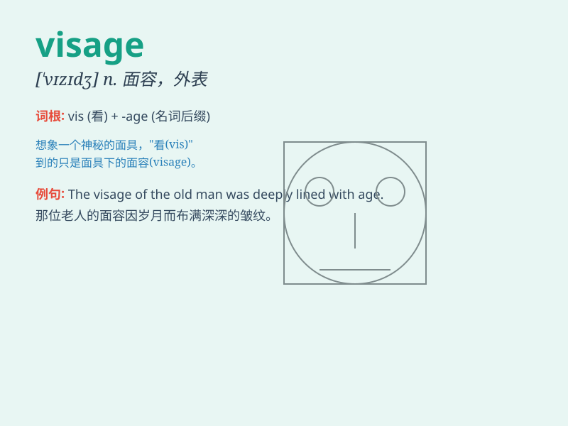

## visage

**英音:** _[\'vɪzɪdʒ]_ **美音:** _[ˈvɪzɪdʒ]_

**译义:** *n.\<书>面貌,容貌*

### 短语

+ **pale visage:** _苍白的面容_

+ **stern visage:** _严厉的面容_

+ **angelic visage:** _天使般的面容_

+ **hideous visage:** _丑陋的面容_

+ **sweet visage:** _甜美的面容_

### 例句

#### 例句1

> **The visage of the old man was lined with wrinkles.**

**中文翻译:** 这位老人的面容布满了皱纹。

**单词释义:** 面容；脸

#### 例句2

> **Her beautiful visage attracted many admirers.**

**中文翻译:** 她美丽的面容吸引了许多倾慕者。

**单词释义:** 面容；脸

#### 例句3

> **Under the mask, his visage remained hidden.**

**中文翻译:** 在面具之下，他的面容仍然隐藏着。

**单词释义:** 面容；脸

### 背诵小故事

> A brave knight was on a quest. When he finally reached the mysterious
castle, he saw a ghostly visage in the window. It was a pale and scary
face that made his heart race. But he gathered his courage and moved on.

**一位勇敢的骑士正在进行探索。当他最终到达神秘的城堡时，他在窗户里看到了一张幽灵般的面容。那是一张苍白可怕的脸，让他心跳加速。但他鼓起勇气继续前进。**

### 图义

