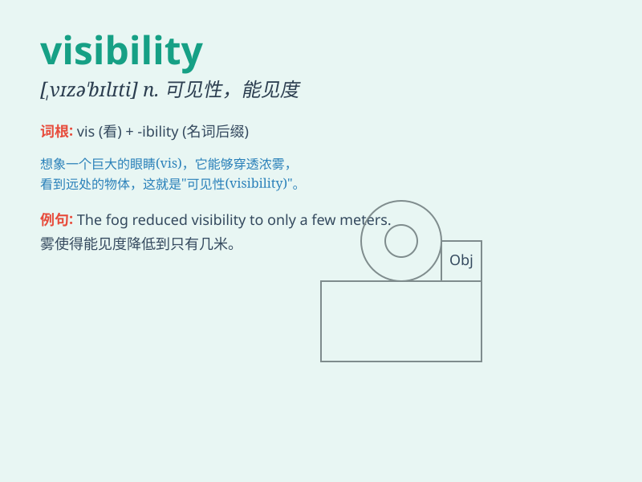

## visibility

**英音:** _[vɪzɪ\'bɪlɪtɪ]_ **美音:** _[\'vɪzə\'bɪləti]_

**译义:** *n.可见度,可见性,显著,明显度,能见度*

### 短语

+ **low visibility:** _低能见度_

+ **good visibility:** _良好的能见度_

+ **visibility range:** _能见距离；可见范围_

+ **improve visibility:** _提高能见度_

+ **reduce visibility:** _降低能见度_

### 例句

#### 例句1

> **The fog reduced visibility on the road to less than 50
meters.**

**中文翻译:** 大雾使道路上的能见度降低到不足 50 米。

**单词释义:** 能见度

#### 例句2

> **The company is working to improve its visibility in the
market.**

**中文翻译:** 这家公司正在努力提高其在市场上的知名度。

**单词释义:** 知名度

#### 例句3

> **The trees blocked the visibility of the house from the
street.**

**中文翻译:** 这些树挡住了从街上看这所房子的视线。

**单词释义:** 视线

### 背诵小故事

> One day, a little bird was lost in the fog. It couldn\'t find its way
home because of poor visibility. But when the fog cleared and visibility
improved, it finally saw the familiar path and flew back happily.

**有一天，一只小鸟在雾中迷路了。由于能见度差，它找不到回家的路。但当雾散去，能见度提高时，它终于看到了熟悉的道路，开心地飞了回去。**

### 图义

