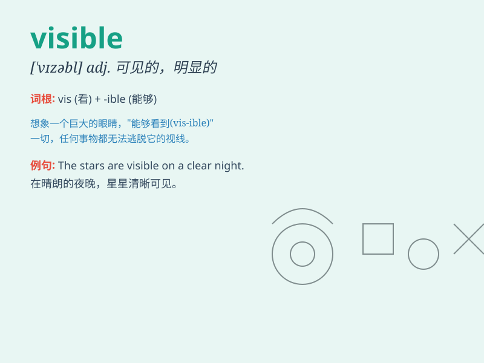

## visible

**英音:** _[ˈvɪzəbl]_ **美音:** _[\'vɪzəbl]_

**译义:** *adj.看得见的,明显的,显著的n.可见物*

### 短语

+ **visible light:** _可见光_

+ **visible improvement:** _明显的改进_

+ **visible sign:** _明显的迹象_

+ **visible damage:** _可见的损坏_

+ **become visible:** _变得可见_

### 例句

#### 例句1

> **The stars are not visible on a cloudy night.**

**中文翻译:** 在多云的夜晚，星星是看不见的。

**单词释义:** 看得见的；可见的

#### 例句2

> **The damage to the building was clearly visible.**

**中文翻译:** 这座建筑物的损坏清晰可见。

**单词释义:** 明显的；清晰的

#### 例句3

> **She became visible when she stepped out of the shadow.**

**中文翻译:** 当她从阴影中走出来时，她变得可见了。

**单词释义:** 能看见的；能被注意到的

### 背诵小故事

> A thief tried to steal at night but was caught because the moonlight
made him visible. The police easily saw him and arrested him. So,
visible means able to be seen.

**一个小偷试图在晚上行窃，但被抓住了，因为月光让他暴露无遗。警察很容易就看到了他并逮捕了他。所以，visible
意思是能被看见的。**

### 图义

