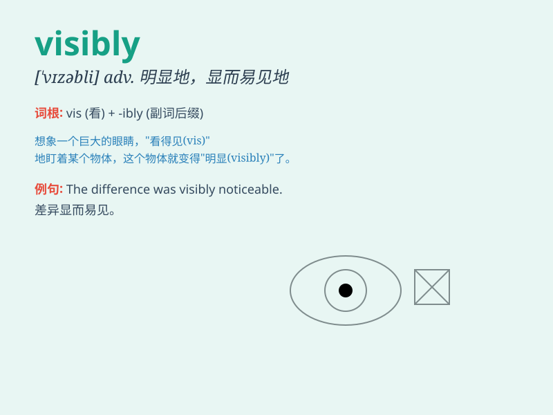

## visibly

**英音:** _[ˈvɪzəbli]_ **美音:** _[ˈvɪzəbli]_

**译义:** *adv.显然*

### 短语

+ **visibly shaken:** _明显地受到震动_

+ **visibly angry:** _明显生气_

+ **visibly relieved:** _明显地松了一口气_

+ **visibly improved:** _明显改善_

+ **visibly excited:** _明显兴奋_

### 例句

#### 例句1

> **She was visibly shaken by the news.**

**中文翻译:** 她显然被这个消息震惊了。

**单词释义:** 明显地；显然地

#### 例句2

> **The improvement in his condition was visibly noticeable.**

**中文翻译:** 他病情的好转明显可见。

**单词释义:** 明显地；显然地

#### 例句3

> **He was visibly angry when he heard the result.**

**中文翻译:** 当他听到结果时，明显很生气。

**单词释义:** 明显地；显然地

### 背诵小故事

> A thief was stealing in the market. When the police showed up, he was
visibly nervous. His hands were shaking and his eyes kept looking
around. Visibly here means clearly and obviously seen.

**一个小偷正在市场里偷东西。当警察出现时，他明显地很紧张。他的手在颤抖，眼睛不停地四处张望。这里的'visibly'意思是清晰可见地、明显地。**

### 图义

