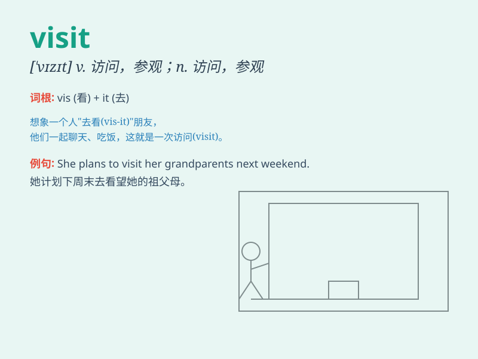

## visit

**英音:** _[\'vɪzɪt]_ **美音:** _[\'vɪzɪt]_

**译义:**
*n.拜访,访问,游览,参观,(作客)逗留,视察,调查vt.拜访,访问,参观,视察,降临vi.访问,参观,闲谈*

### 短语

+ **pay a visit:** _进行访问；拜访_

+ **visit with:** _与\...\...闲谈；与\...\...聊天_

+ **home visit:** _家访；上门访问_

+ **visit friends:** _拜访朋友_

+ **official visit:** _正式访问；官方访问_

### 例句

#### 例句1

> **I visited my grandparents last weekend.**

**中文翻译:** 上周末我看望了我的祖父母。

**单词释义:** 看望；拜访

#### 例句2

> **They are planning to visit the Louvre Museum in Paris.**

**中文翻译:** 他们正计划参观巴黎的卢浮宫博物馆。

**单词释义:** 参观

#### 例句3

> **The doctor visits patients every morning.**

**中文翻译:** 医生每天上午看望病人。

**单词释义:** 探望

### 背诵小故事

> One day, a little girl named Lily was very happy because her friend
Tom came to visit her. They played games and had a great time together.
The word \'visit\' means to go and see someone or some place.

**有一天，一个叫莉莉的小女孩非常开心，因为她的朋友汤姆来看望她了。他们一起玩游戏，度过了一段美好的时光。单词\'visit\'意思是去看望某人或某地。**

### 图义

