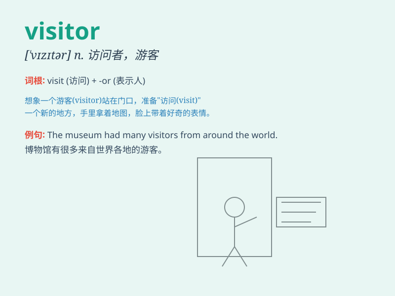

## visitor

**英音:** _[\'vɪzɪtə]_ **美音:** _[\'vɪzɪtɚ]_

**译义:** *n.访问者,来宾,游客*

### 短语

+ **frequent visitor:** _常客_

+ **casual visitor:** _临时访客_

+ **first-time visitor:** _初访者_

+ **uninvited visitor:** _不速之客_

+ **overnight visitor:** _过夜的访客_

### 例句

#### 例句1

> **The museum had a large number of visitors yesterday.**

**中文翻译:** 昨天博物馆有大量的参观者。

**单词释义:** 参观者

#### 例句2

> **We need to be friendly to every visitor.**

**中文翻译:** 我们需要对每一位访客友好。

**单词释义:** 访客

#### 例句3

> **The park attracts many visitors in spring.**

**中文翻译:** 这个公园在春天吸引了很多游客。

**单词释义:** 游客

### 背诵小故事

> One day, a strange man came to our town. Everyone was curious about
him. Later we knew he was a visitor who traveled around to experience
different places. He brought new stories and made our town more lively.

**有一天，一个陌生的男人来到了我们的小镇。每个人都对他感到好奇。后来我们知道他是一个游客，到处旅行以体验不同的地方。他带来了新的故事，让我们的小镇更热闹了。**

### 图义

