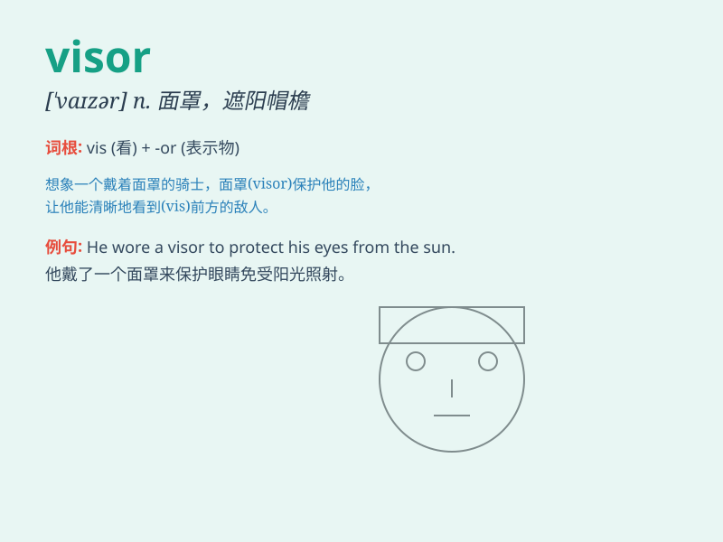

## visor

**英音:** _[\'vaɪzə]_ **美音:** _[\'vaɪzɚ]_

**译义:** *n.面颊,帽舌,盔甲vt.(用脸盔,护目镜等)遮护*

### 短语

+ **visor cap:** _遮阳帽_

+ **motorcycle visor:** _摩托车头盔面罩_

+ **sun visor:** _遮阳板_

+ **visor mask:** _面罩_

+ **welding visor:** _电焊面罩_

### 例句

#### 例句1

> **The motorcyclist wore a helmet with a tinted visor to protect his
eyes from the sun.**

**中文翻译:**
这位摩托车手戴着一顶带有有色面罩的头盔，以保护他的眼睛免受阳光照射。

**单词释义:** （头盔的）面罩

#### 例句2

> **The soldier lowered his visor before going into battle.**

**中文翻译:** 这名士兵在投入战斗前放下了他的头盔护面。

**单词释义:** （头盔的）护面

#### 例句3

> **She adjusted the visor of her cap to shield her face from the
wind.**

**中文翻译:** 她调整了帽子的帽舌以遮挡脸免受风吹。

**单词释义:** 帽舌

### 背诵小故事

> A knight was going to a battle. But the sun was too bright. Luckily,
he found a visor in his bag and put it on his helmet to protect his
eyes. With the visor, he could see clearly and fought bravely.

**一位骑士正要去战斗。但阳光太刺眼了。幸运的是，他在包里找到了一个帽舌，并把它装在头盔上以保护眼睛。有了帽舌，他能看得清楚并英勇作战。**

### 图义

