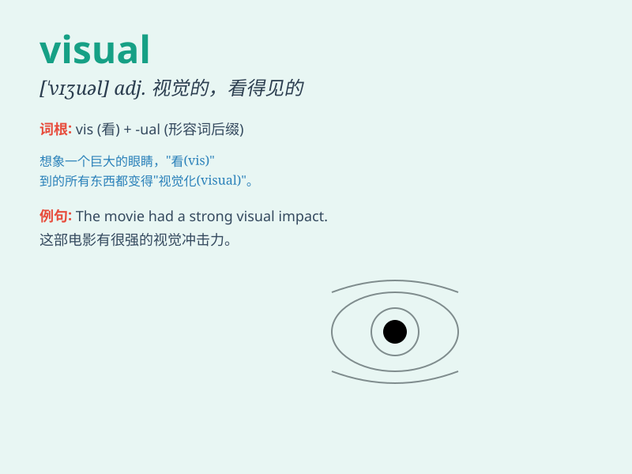

## visual

**英音:** _[\'vɪʒjʊəl; -zj-]_ **美音:** _[\'vɪʒʊəl]_

**译义:** *adj.看的,视觉的,形象的,栩栩如生的*

### 短语

+ **visual aid:** _直观教具_

+ **visual art:** _视觉艺术_

+ **visual effect:** _视觉效果_

+ **visual field:** _视野_

+ **visual perception:** _视觉感知_

### 例句

#### 例句1

> **The visual effects in the movie were stunning.**

**中文翻译:** 这部电影中的视觉效果令人惊叹。

**单词释义:** 视觉的

#### 例句2

> **She has a strong visual memory.**

**中文翻译:** 她有很强的视觉记忆。

**单词释义:** 视觉的

#### 例句3

> **The artist\'s work is highly visual and appealing.**

**中文翻译:** 这位艺术家的作品非常直观且吸引人。

**单词释义:** 直观的；看得见的

### 背诵小故事

> A painter was always seeking the perfect visual effect. One day, he
saw a beautiful rainbow and was deeply inspired. He realized that
\'visual\' means what we see and how it affects us.

**一位画家总是在寻求完美的视觉效果。有一天，他看到了一道美丽的彩虹深受启发。他意识到\'visual\'这个词意味着我们所看到的以及它对我们的影响。**

### 图义

