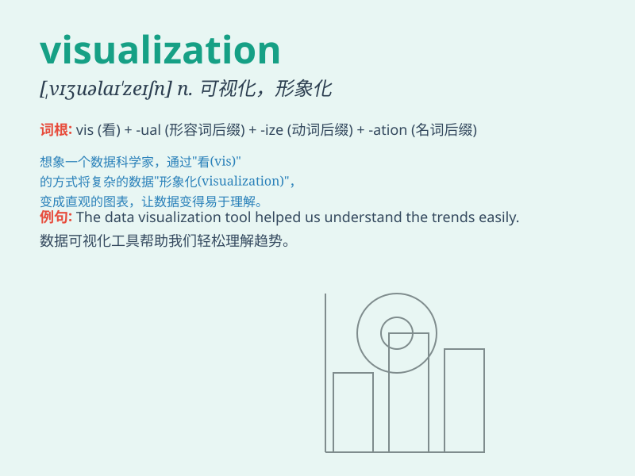

## visualization

**英音:** _[,vɪzjʊəlaɪ\'zeɪʃən]_ **美音:**
_[,vɪʒʊəlɪ\'zeʃən]_

**译义:** *n.使看得见的,清楚地呈现在心*

### 短语

+ **data visualization:** _数据可视化_

+ **visualization technique:** _可视化技术_

+ **information visualization:** _信息可视化_

+ **scientific visualization:** _科学可视化_

+ **visualization tool:** _可视化工具_

### 例句

#### 例句1

> **The visualization of data helps us understand complex information
more easily.**

**中文翻译:** 数据的可视化帮助我们更容易理解复杂的信息。

**单词释义:** 可视化；形象化

#### 例句2

> **The artist\'s visualization of the future city was both creative
and inspiring.**

**中文翻译:** 这位艺术家对未来城市的想象既富有创意又令人鼓舞。

**单词释义:** 想象；构想

#### 例句3

> **The software provides powerful visualization tools for scientific
research.**

**中文翻译:** 该软件为科学研究提供了强大的可视化工具。

**单词释义:** 可视化（的手段、方法）

### 背诵小故事

> One day, a little artist was trying to create a beautiful picture in
his mind. He imagined every detail, the colors, the shapes. This process
was like \'visualization\', making what was in his mind visible.

**有一天，一位小艺术家试图在脑海中创作一幅美丽的图画。他想象着每一个细节，颜色、形状。这个过程就像'形象化；可视化'，让脑海中的东西变得可见。**

### 图义

