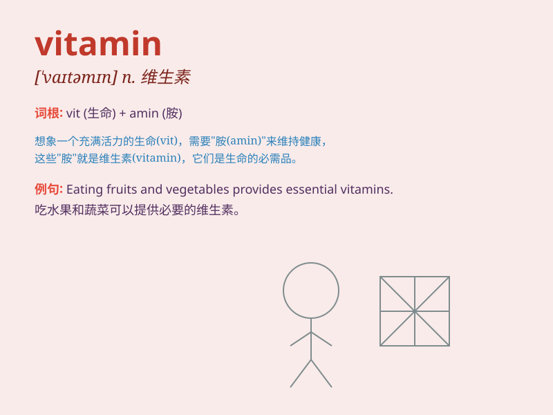

## vitamin

**英音:** _[\'vɪtəmɪn; \'vaɪt-]_ **美音:**
_[\'vaɪtəmɪn]_

**译义:** *n.维他命,维生素*

### 短语

+ **vitamin A:** _维生素 A_

+ **vitamin B complex:** _复合维生素 B_

+ **vitamin C:** _维生素 C_

+ **vitamin deficiency:** _维生素缺乏_

+ **vitamin supplement:** _维生素补充剂_

### 例句

#### 例句1

> **Oranges are rich in vitamin C.**

**中文翻译:** 橙子富含维生素 C。

**单词释义:** 维生素

#### 例句2

> **You should take vitamin supplements to stay healthy.**

**中文翻译:** 你应该服用维生素补充剂来保持健康。

**单词释义:** 维生素

#### 例句3

> **A lack of vitamin D can cause bone problems.**

**中文翻译:** 缺乏维生素 D 会导致骨骼问题。

**单词释义:** 维生素

### 背诵小故事

> Once upon a time, a little boy was always weak and ill. A doctor told
him to take \'vitamin\' pills every day. After that, he became strong
and healthy. So, vitamin is like a magic key to good health.

**从前，有个小男孩总是体弱多病。一位医生告诉他每天服用"维生素"片。之后，他变得强壮又健康。所以，维生素就像是通往健康的神奇钥匙。**

### 图义

