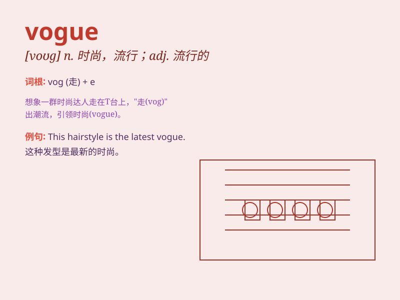

## vogue

**英音:** _[vəʊg]_ **美音:** _[voɡ]_

**译义:** *n.时尚,时髦,风气,流行,风行adj.流行的,时髦的*

### 短语

+ **be in vogue:** _正在流行；时髦_

+ **come into vogue:** _开始流行；变得时髦_

+ **set the vogue:** _开创时尚；引领潮流_

+ **follow the vogue:** _跟随潮流；赶时髦_

+ **pass out of vogue:** _不再流行；过时_

### 例句

#### 例句1

> **This style of dress is currently in vogue.**

**中文翻译:** 这种款式的连衣裙目前很流行。

**单词释义:** 流行；时髦

#### 例句2

> **Minimalist design has come into vogue in recent years.**

**中文翻译:** 极简主义设计近年来开始流行起来。

**单词释义:** 流行；盛行

#### 例句3

> **The new fashion trend is setting the vogue for this season.**

**中文翻译:** 新的时尚潮流正在为本季设定流行趋势。

**单词释义:** 时尚；流行样式

### 背诵小故事

> A young designer dreams of creating a dress that catches the vogue.
She works hard, using unique fabrics and styles. Finally, her dress
becomes the trend and leads the vogue in the fashion world.

**一位年轻的设计师梦想设计出一件引领时尚潮流的裙子。她努力工作，使用独特的面料和款式。最终，她的裙子成为了潮流，引领了时尚界的风尚。**

### 图义

