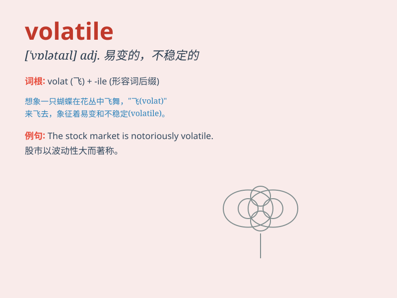

## volatile

**英音:** _[\'vɒlətaɪl]_ **美音:** _[\'vɑlətl]_

**译义:**
*adj.飞行的,挥发性的,可变的,不稳定的,轻快的,爆炸性的n.[现罕]有翅的动物,挥发物*

### 短语

+ **volatile market:** _波动的市场_

+ **volatile substance:** _挥发性物质_

+ **volatile situation:** _不稳定的局势_

+ **volatile memory:** _易失性存储器_

+ **volatile oil:** _挥发油_

### 例句

#### 例句1

> **The political situation in the region is highly volatile.**

**中文翻译:** 该地区的政治局势非常不稳定。

**单词释义:** 不稳定的；易变的

#### 例句2

> **Petrol is a volatile substance.**

**中文翻译:** 汽油是挥发性物质。

**单词释义:** 挥发性的

#### 例句3

> **The stock market has been very volatile recently.**

**中文翻译:** 最近股市一直波动很大。

**单词释义:** 波动的；易波动的

### 背诵小故事

> 想象一个脾气不稳定的小精灵，它的情绪就像 volatile
这个词一样。一会儿开心地飞舞，一会儿愤怒地喷火。它的状态变化迅速且难以预测，就像
volatile 所表示的'不稳定的；易变的'。

**想象一个脾气不稳定的小精灵来辅助记忆'volatile（不稳定的；易变的）'这个单词**

### 图义

