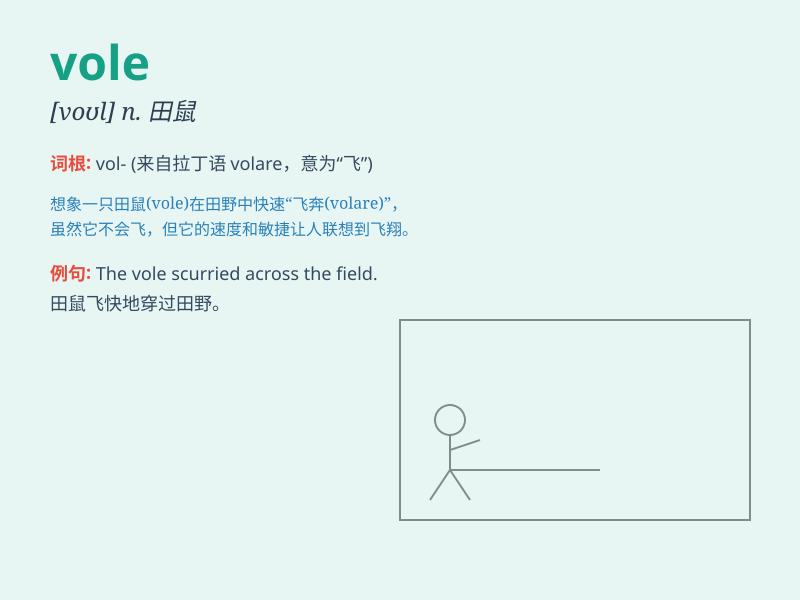

## vole

**英音:** _[vəʊl]_ **美音:** _[vol]_

**译义:** *n.野鼠类,全胜,大满贯,孤注一掷,什么都干过*

### 短语

+ **water vole:** _水鼠_

+ **field vole:** _田鼠_

+ **bank vole:** _岸田鼠_

+ **vole hole:** _田鼠洞_

+ **vole run:** _田鼠跑道_

### 例句

#### 例句1

> **The vole scurried across the field.**

**中文翻译:** 那只田鼠匆匆跑过田野。

**单词释义:** 田鼠

#### 例句2

> **We saw a vole near the riverbank.**

**中文翻译:** 我们在河岸附近看到了一只田鼠。

**单词释义:** 田鼠

#### 例句3

> **The vole dug a hole in the ground.**

**中文翻译:** 这只田鼠在地上挖了一个洞。

**单词释义:** 田鼠

### 背诵小故事

> A vole was running in the field. It was small but very fast. One day,
it found a big carrot and was so happy. Remember, vole is a kind of
small animal like this.

**一只田鼠在田野里奔跑。它很小但速度非常快。有一天，它找到了一个大胡萝卜，高兴极了。记住，vole
就是像这样的一种小动物。**

### 图义

