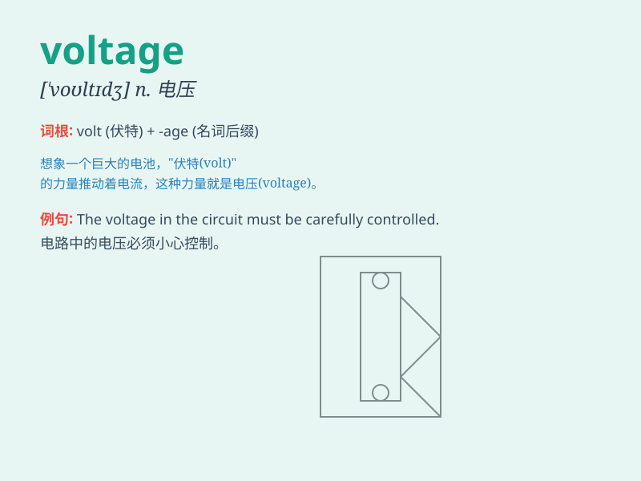

## voltage

**英音:** _[\'vəʊltɪdʒ; \'vɒltɪdʒ]_ **美音:**
_[\'voltɪdʒ]_

**译义:** *n.[电工]电压,伏特数*

### 短语

+ **voltage drop:** _电压降_

+ **voltage divider:** _分压器_

+ **voltage regulator:** _稳压器_

+ **voltage supply:** _电源；电压供应_

+ **voltage measurement:** _电压测量_

### 例句

#### 例句1

> **The voltage in this circuit is too high.**

**中文翻译:** 这个电路中的电压太高了。

**单词释义:** 电压

#### 例句2

> **We need to measure the voltage accurately.**

**中文翻译:** 我们需要精确测量电压。

**单词释义:** 电压

#### 例句3

> **The voltage drop across the resistor is significant.**

**中文翻译:** 电阻两端的电压降很显著。

**单词释义:** 电压

### 背诵小故事

> One day, a scientist was working on an experiment. The key to success
was the \'voltage\' of the electricity. If it was too low or too high,
the experiment would fail. Finally, he adjusted the voltage perfectly
and achieved great results.

**有一天，一位科学家正在进行一项实验。成功的关键在于电的"电压"。如果电压太低或太高，实验就会失败。最后，他完美地调整了电压，并取得了巨大的成果。**

### 图义

