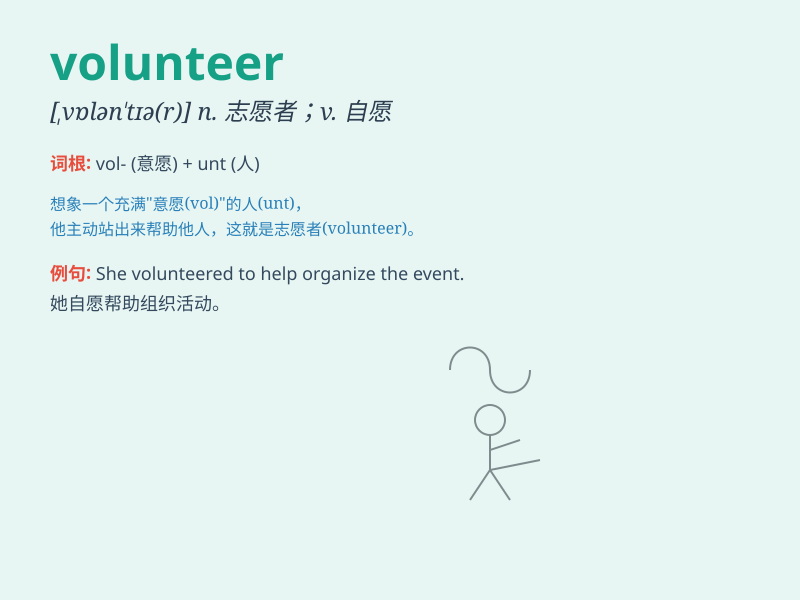

## volunteer

**英音:** _[,vɒlən\'tɪə]_ **美音:** _[,vɑlən\'tɪr]_

**译义:** *n.志愿者,志愿兵adj.志愿的,义务的,无偿的v.自愿*

### 短语

+ **volunteer work:** _志愿工作_

+ **volunteer service:** _志愿服务_

+ **volunteer group:** _志愿者团体_

+ **volunteer activity:** _志愿活动_

+ **volunteer soldier:** _志愿兵_

### 例句

#### 例句1

> **She volunteers at the local hospital every weekend.**

**中文翻译:** 她每个周末都在当地医院做志愿者。

**单词释义:** 自愿做，义务做

#### 例句2

> **The event was staffed by volunteers.**

**中文翻译:** 这次活动由志愿者操办。

**单词释义:** 志愿者

#### 例句3

> **He volunteered to help with the project.**

**中文翻译:** 他自愿帮忙做这个项目。

**单词释义:** 自愿

### 背诵小故事

> One day, in a small town, a fire broke out. Many people rushed to
help. Among them, Tom was a volunteer. He didn\'t get paid but did it
out of kindness. His action showed the spirit of volunteer.

**有一天，在一个小镇上发生了火灾。许多人赶来帮忙。其中，汤姆是一名志愿者。他没有报酬，只是出于善良去做。他的行为展现了志愿者的精神。**

### 图义

