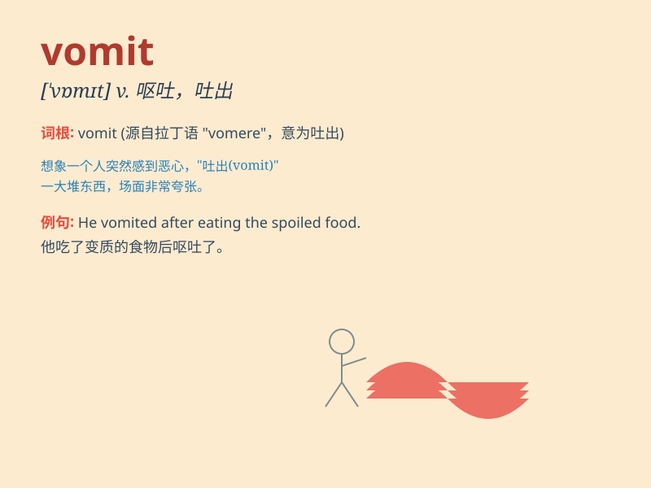

## vomit

**英音:** _[\'vɒmɪt]_ **美音:** _[\'vɑmɪt]_

**译义:** *n.呕吐,呕吐物,催吐剂vi.呕吐,大量喷出vt.吐出,呕吐*

### 短语

+ **vomit up:** _呕出；吐出_

+ **vomit blood:** _吐血_

+ **chronic vomiting:** _慢性呕吐_

+ **vomit forth:** _喷出；大量涌出_

+ **vomit out:** _呕吐出；倾吐_

### 例句

#### 例句1

> **He felt sick and began to vomit.**

**中文翻译:** 他感到不舒服，开始呕吐。

**单词释义:** 呕吐

#### 例句2

> **The smell made her want to vomit.**

**中文翻译:** 这气味使她想呕吐。

**单词释义:** 呕吐

#### 例句3

> **After drinking too much alcohol, he vomited all over the
floor.**

**中文翻译:** 喝了太多酒之后，他吐得满地都是。

**单词释义:** 呕吐

### 背诵小故事

> One day, Tom ate too much junk food and felt very sick. Suddenly, he
couldn\'t hold it anymore and began to vomit. The unpleasant scene made
him realize the importance of a healthy diet.

**有一天，汤姆吃了太多垃圾食品，感觉非常难受。突然，他忍不住开始呕吐。这令人不适的场景让他意识到健康饮食的重要性。**

### 图义

