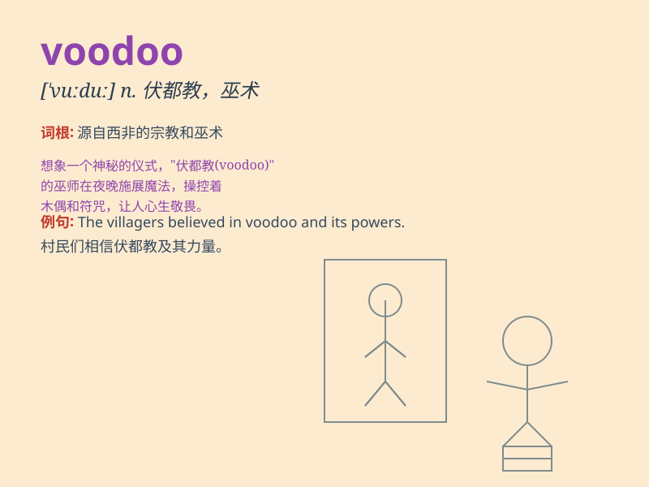

## voodoo

**英音:** _[\'vuːduː]_ **美音:** _[\'vudu]_

**译义:**
*n.伏都教(一种西非原始宗教),伏都教徒;adj.伏都教的;vt.施伏都巫术迷惑;一种图形加速芯片*

### 短语

+ **voodoo doll:** _巫毒娃娃_

+ **voodoo magic:** _巫毒魔法_

+ **voodoo priest:** _巫毒祭司_

+ **voodoo ritual:** _巫毒仪式_

+ **voodoo curse:** _巫毒诅咒_

### 例句

#### 例句1

> **Some people believe in the power of voodoo to cure diseases.**

**中文翻译:** 一些人相信巫毒术有治病的力量。

**单词释义:** 巫毒（一种宗教信仰和魔法实践）

#### 例句2

> **The voodoo priestess performed a ritual to protect the
village.**

**中文翻译:** 巫毒女祭司举行仪式来保护村庄。

**单词释义:** 巫毒（宗教仪式）

#### 例句3

> **He accused her of using voodoo to curse him.**

**中文翻译:** 他指责她用巫毒术诅咒他。

**单词释义:** 巫毒（诅咒的手段）

### 背诵小故事

> A traveler ventured into a mysterious jungle. There, he heard tales
of voodoo magic. People said it could control minds. But he remained
skeptical. Voodoo seemed like a strange and scary power.

**一位旅行者冒险进入神秘的丛林。在那里，他听到了有关巫毒魔法的故事。人们说它可以控制思想。但他仍然持怀疑态度。巫毒似乎是一种奇怪又可怕的力量。**

### 图义

