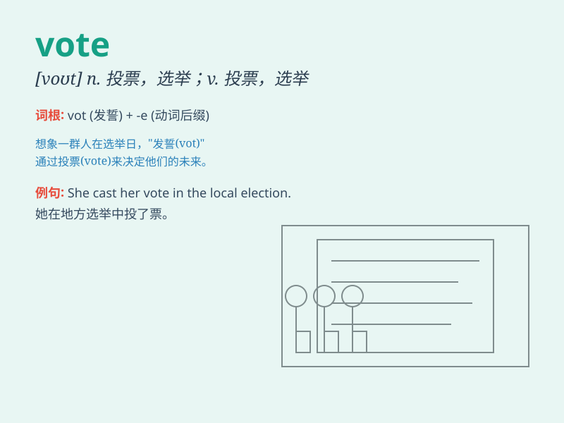

## vote

**英音:** _[vəʊt]_ **美音:** _[vot; voʊt]_

**译义:**
*n.投票,选举,选票,选举权,表决,得票数vi.投票,选举vt.投票选举,投票决定,公认,\<口>建议,使投票*

### 短语

+ **vote for:** _投票赞成；为\...投票_

+ **vote against:** _投票反对_

+ **vote on:** _就\...表决_

+ **cast a vote:** _投票_

+ **majority vote:** _多数票_

### 例句

#### 例句1

> **I will vote for the candidate who has the best policies.**

**中文翻译:** 我会投票给政策最好的候选人。

**单词释义:** 投票；表决

#### 例句2

> **The vote was unanimous in favor of the proposal.**

**中文翻译:** 投票一致赞成这个提议。

**单词释义:** 投票；选票

#### 例句3

> **She exercised her right to vote in the local election.**

**中文翻译:** 她在当地选举中行使了她的投票权。

**单词释义:** 投票；选举权

### 背诵小故事

> In a small village, the mayor election was coming. Everyone was
excited to vote. Tom carefully chose the candidate he thought could make
the village better. Finally, the result was announced based on people\'s
votes.

**在一个小村庄，市长选举即将到来。每个人都兴奋地去投票。汤姆仔细地选择了他认为能让村庄变得更好的候选人。最后，根据人们的投票公布了结果。**

### 图义

