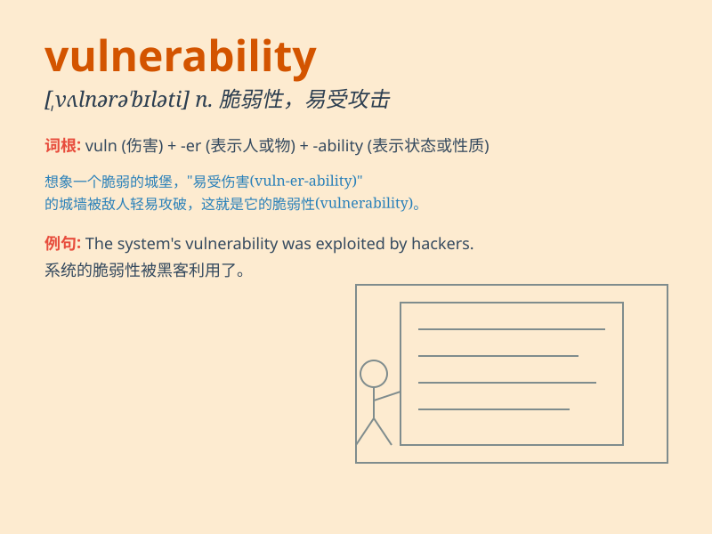

## vulnerability

**英音:** _[,vʌlnərə\'bɪlətɪ]_ **美音:**
_[,vʌlnərə\'bɪləti]_

**译义:** *n.弱点,攻击*

### 短语

+ **vulnerability assessment:** _脆弱性评估_

+ **vulnerability analysis:** _脆弱性分析_

+ **vulnerability exploitation:** _脆弱性利用_

+ **vulnerability management:** _脆弱性管理_

+ **reduce vulnerability:** _减少脆弱性_

### 例句

#### 例句1

> **The company\'s vulnerability to cyber attacks was exposed.**

**中文翻译:** 该公司容易受到网络攻击的弱点被暴露了。

**单词释义:** 易受攻击的弱点

#### 例句2

> **She showed a vulnerability that few had seen before.**

**中文翻译:** 她表现出了一种很少有人见过的脆弱性。

**单词释义:** 脆弱性

#### 例句3

> **His emotional vulnerability made him prone to depression.**

**中文翻译:** 他情感上的脆弱使他容易抑郁。

**单词释义:** 脆弱

### 背诵小故事

> A knight was on a quest but had a vulnerability - a weak spot in his
armor. Enemies found it and he was in danger. This weakness is like
\'vulnerability\', meaning the state of being exposed to the possibility
of being attacked or harmed.

**一位骑士在执行任务，但他有一个弱点------盔甲上的薄弱点。敌人发现了，他陷入危险。这个弱点就像\'vulnerability\'，意思是处于可能受到攻击或伤害的状态。**

### 图义

