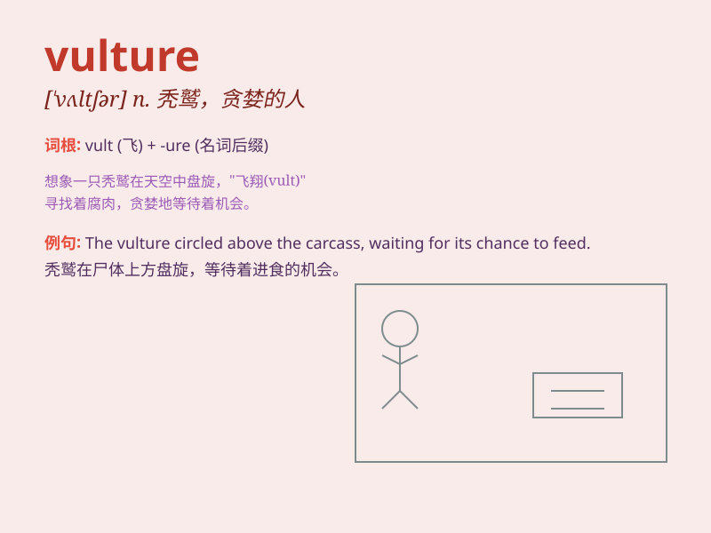

## vulture

**英音:** _[\'vʌltʃə]_ **美音:** _[\'vʌltʃɚ]_

**译义:** *n.秃鹰,贪婪的人*

### 短语

+ **black vulture:** _黑兀鹫_

+ **turkey vulture:** _红头美洲鹫_

+ **vulture fund:** _秃鹫基金_

+ **vulture capitalist:** _兀鹫资本家_

+ **vulture culture:** _兀鹫文化_

### 例句

#### 例句1

> **The vulture circled high in the sky, waiting for its prey to
die.**

**中文翻译:** 这只秃鹫在高空盘旋，等待它的猎物死去。

**单词释义:** 秃鹫

#### 例句2

> **Vultures are often associated with death and decay.**

**中文翻译:** 秃鹫常常与死亡和腐烂联系在一起。

**单词释义:** 秃鹫

#### 例句3

> **The vulture swooped down to claim its meal.**

**中文翻译:** 这只秃鹫俯冲下来获取它的食物。

**单词释义:** 秃鹫

### 背诵小故事

> In the vast desert, a traveler was lost and weak. Suddenly, a vulture
appeared in the sky, circling above. It seemed to sense the traveler\'s
vulnerability, waiting for a possible tragic end. But the traveler found
his way out and the vulture flew away disappointed.

**在广袤的沙漠中，一位旅行者迷路且虚弱。突然，一只秃鹫出现在天空中，盘旋在上空。它似乎感觉到旅行者的脆弱，等待着可能的悲惨结局。但旅行者找到了出路，秃鹫失望地飞走了。**

### 图义

