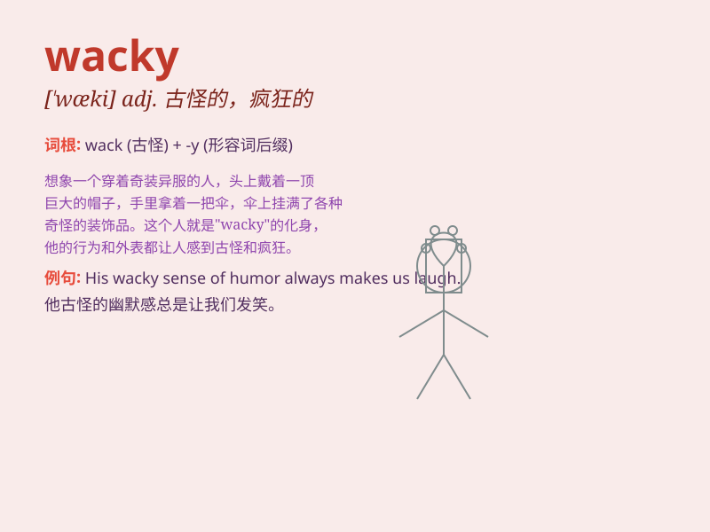

## wacky

**英音:** _[ˈwæki]_ **美音:** _[ˈwæki]_

**译义:** *adj.\<美俚>古怪的,乖僻的,疯疯癫癫的*

### 短语

+ **wacky idea:** _古怪的想法_

+ **wacky sense of humor:** _怪异的幽默感_

+ **wacky behavior:** _古怪的行为_

+ **wacky costume:** _奇装异服_

+ **wacky adventure:** _奇异的冒险_

### 例句

#### 例句1

> **The wacky clown at the circus had everyone laughing.**

**中文翻译:** 马戏团里那个古怪的小丑让所有人都笑了。

**单词释义:** 古怪的；滑稽可笑的

#### 例句2

> **She came up with some wacky ideas for the party.**

**中文翻译:** 她为聚会想出了一些古怪的主意。

**单词释义:** 古怪的；异想天开的

#### 例句3

> **His wacky sense of humor always surprises me.**

**中文翻译:** 他那古怪的幽默感总是让我感到惊讶。

**单词释义:** 古怪的；奇特的

### 背诵小故事

> One day, I saw a man wearing a wacky hat with colorful feathers. He
danced in a strange way, making everyone laugh. His wacky style was
unforgettable.

**有一天，我看到一个男人戴着一顶有着彩色羽毛的古怪帽子。他以一种奇怪的方式跳舞，让每个人都大笑。他那古怪的风格令人难以忘怀。**

### 图义

