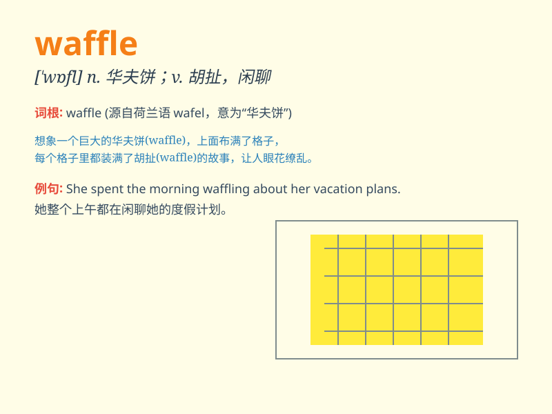

## waffle

**英音:** _[\'wɒf(ə)l]_ **美音:** _[\'wɑfl]_

**译义:** *vi.闲聊,胡扯n.华夫饼干,无聊话,动听而无意义的话*

### 短语

+ **waffle on:** _唠叨；胡扯；说废话_

+ **waffle iron:** _华夫饼烤盘；烘华夫饼的铁模_

+ **Belgian waffle:** _比利时华夫饼_

+ **waffle house:** _华夫饼屋（餐厅名）_

+ **waffle pattern:** _华夫格图案_

### 例句

#### 例句1

> **I love having waffles for breakfast.**

**中文翻译:** 我喜欢早餐吃华夫饼。

**单词释义:** 华夫饼

#### 例句2

> **She waffled on the decision for hours.**

**中文翻译:** 她在这个决定上犹豫了好几个小时。

**单词释义:** 犹豫不决；含糊其辞

#### 例句3

> **Don\'t waffle and tell me the truth.**

**中文翻译:** 别支支吾吾的，跟我说实话。

**单词释义:** 支支吾吾；说话含糊

### 背诵小故事

> One day, Tom was at a fair and saw a vendor selling waffles. The
waffles looked so delicious with their square patterns. Tom bought one
and enjoyed its sweet taste. From then on, whenever he thought of
waffles, he remembered that happy day.

**有一天，汤姆在集市上看到一个小贩在卖华夫饼。华夫饼有着方形的图案，看起来十分美味。汤姆买了一个，享受着它的香甜味道。从那以后，每当他想到华夫饼，就会想起那快乐的一天。**

### 图义

