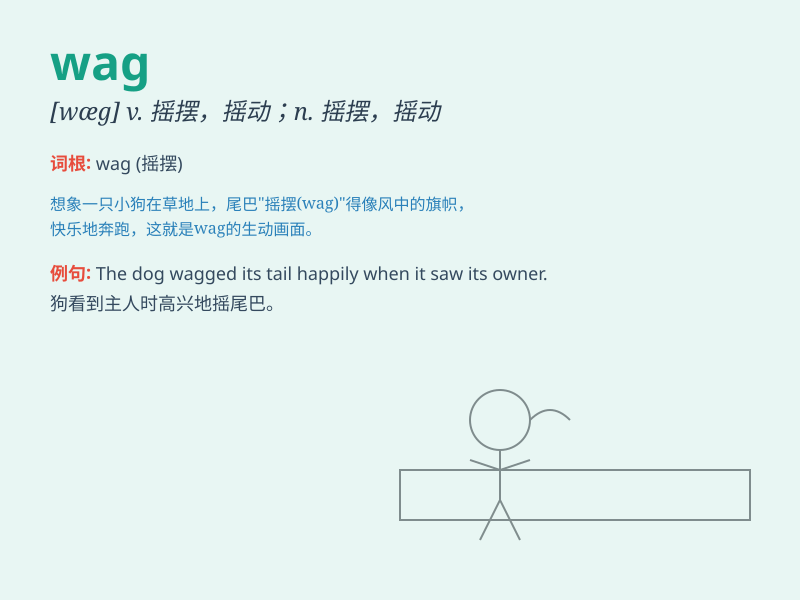

## wag

**英音:** _[wæg]_ **美音:** _[wæɡ]_

**译义:**
*vt.摇摆,摇动,饶舌vi.爱说笑打趣的人,摆动,喋喋不休n.摇摆,小丑*

### 短语

+ **wag one\'s tail:** _（狗）摇尾巴_

+ **wag the tongue:** _饶舌；喋喋不休_

+ **wag one\'s finger:** _摇手指（表示不赞成、指责等）_

+ **wag in the wind:** _随风摇摆_

+ **wag one\'s head:** _摇头（表示否定、不同意等）_

### 例句

#### 例句1

> **The dog wagged its tail happily when it saw its owner.**

**中文翻译:** 当狗看到它的主人时，高兴地摇着尾巴。

**单词释义:** （动物尾巴）来回摇摆

#### 例句2

> **She wagged her finger at the naughty child.**

**中文翻译:** 她向那个调皮的孩子摇了摇手指。

**单词释义:** 摇动，摆动（手指等）

#### 例句3

> **His tongue wagged as he told the story.**

**中文翻译:** 他讲故事时滔滔不绝。

**单词释义:** 喋喋不休

### 背诵小故事

> A dog was wagging its tail happily when its owner came home. The
wagging tail showed how excited the dog was to see its master.

**一只狗在主人回家时欢快地摇着尾巴。摇着的尾巴显示出狗见到主人是多么兴奋。**

### 图义

