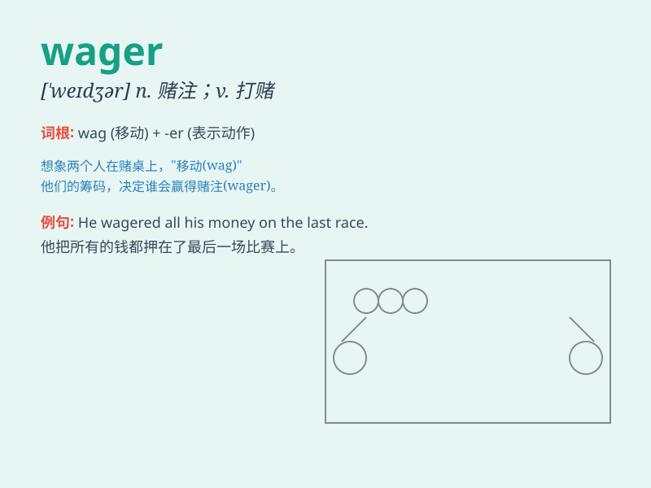

## wager

**英音:** _[ˈweɪdʒə(r)]_ **美音:** _[ˈweɪdʒər]_

**译义:** *n.赌,赌博,赌注vt.下赌注,保证vi.打赌*

### 短语

+ **wager money:** _赌钱_

+ **wager on:** _在\...\...上下赌注_

+ **big wager:** _大赌注_

+ **risky wager:** _冒险的赌注_

+ **win a wager:** _赢得赌注_

### 例句

#### 例句1

> **He decided to make a wager on the horse race.**

**中文翻译:** 他决定在赛马上下赌注。

**单词释义:** 下赌注；打赌

#### 例句2

> **The two friends had a friendly wager on the outcome of the
football game.**

**中文翻译:** 这两个朋友就足球比赛的结果进行了友好的打赌。

**单词释义:** 打赌；赌注

#### 例句3

> **She won the wager and collected her prize.**

**中文翻译:** 她赢得了打赌并领取了奖品。

**单词释义:** 打赌；赌注

### 背诵小故事

> One day, Tom saw a horse race and decided to make a wager. He bet all
his savings on a horse named Lightning. Luckily, Lightning won and Tom
got a big reward. From then on, he knew a wager could bring great risks
or huge gains.

**有一天，汤姆看到一场赛马，决定下注。他把所有的积蓄都押在了一匹叫闪电的马上。幸运的是，闪电赢了，汤姆得到了一大笔奖励。从那以后，他知道了打赌可能带来巨大风险或丰厚回报。**

### 图义

