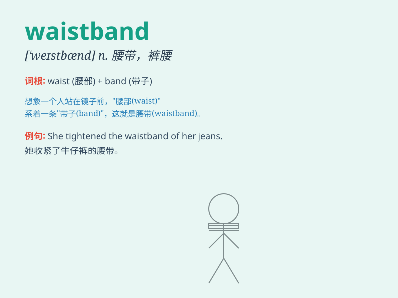

## waistband

**英音:** _[\'weɪs(t)bænd]_ **美音:** _[\'west\'bænd]_

**译义:** *n.腰带,束腰带*

### 短语

+ **elastic waistband:** _弹性腰带_

+ **wide waistband:** _宽腰带_

+ **narrow waistband:** _窄腰带_

+ **waistband adjustment:** _腰带调整_

+ **waistband detail:** _腰带细节_

### 例句

#### 例句1

> **The waistband of these pants is too tight.**

**中文翻译:** 这条裤子的腰带太紧了。

**单词释义:** 腰带；裤腰

#### 例句2

> **She adjusted the waistband of her skirt for a better fit.**

**中文翻译:** 她调整了裙子的腰带以求更合身。

**单词释义:** 腰带；裙腰

#### 例句3

> **The elastic waistband gives more comfort.**

**中文翻译:** 有弹性的腰带更舒适。

**单词释义:** 腰带

### 背诵小故事

> One day, Tom was getting dressed and struggled to fasten his
waistband. He realized it was too tight because he had eaten too many
cakes. He decided to do more exercise to fit into it easily.

**一天，汤姆在穿衣服时，系他的腰带很费劲。他意识到腰带太紧了，因为他吃了太多蛋糕。他决定多做运动，以便轻松系上它。**

### 图义

