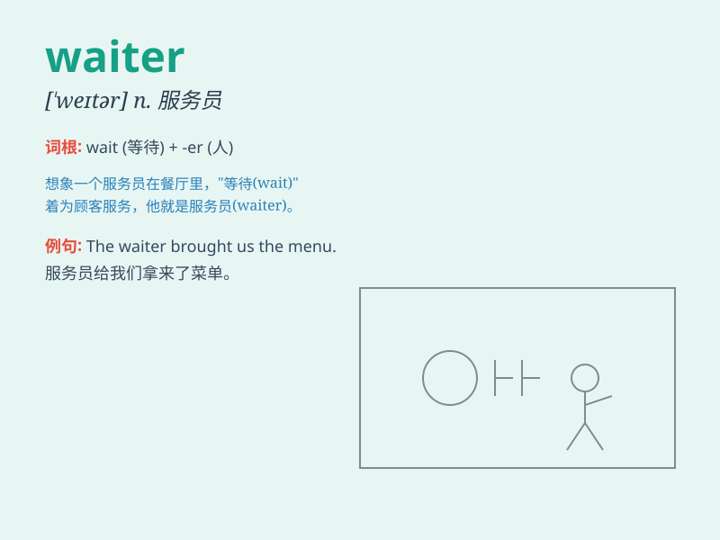

## waiter

**英音:** _[\'weɪtə]_ **美音:** _[\'wetɚ]_

**译义:** *n.侍者,服务员*

### 短语

+ **head waiter:** _餐厅领班_

+ **waiter service:** _侍者服务_

+ **chief waiter:** _首席服务员_

+ **restaurant waiter:** _餐馆服务员_

+ **hotel waiter:** _酒店服务员_

### 例句

#### 例句1

> **The waiter brought us the menu.**

**中文翻译:** 服务员给我们拿来了菜单。

**单词释义:** 服务员

#### 例句2

> **We asked the waiter for some water.**

**中文翻译:** 我们向服务员要了一些水。

**单词释义:** 服务员

#### 例句3

> **The waiter was very polite and helpful.**

**中文翻译:** 这位服务员非常有礼貌且乐于助人。

**单词释义:** 服务员

### 背诵小故事

> One day, I went to a restaurant. When I needed help, a friendly man
came quickly. He was the waiter. He took my order and served me food
with a smile. I remembered the word \'waiter\' because of his nice
service.

**有一天，我去了一家餐厅。当我需要帮助时，一个友好的人很快就来了。他就是服务员。他为我点菜，并微笑着为我上菜。因为他贴心的服务，我记住了'waiter'这个单词。**

### 图义

