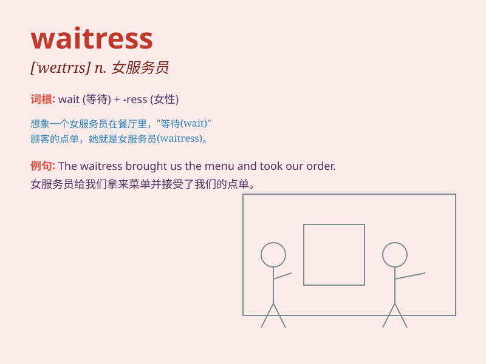

## waitress

**英音:** _[ˈweɪtrəs]_ **美音:** _[ˈwetrɪs]_

**译义:** *n.女服务生*

### 短语

+ **head waitress:** _女领班_

+ **restaurant waitress:** _餐厅女服务员_

+ **experienced waitress:** _有经验的女服务员_

+ **friendly waitress:** _友好的女服务员_

+ **busy waitress:** _忙碌的女服务员_

### 例句

#### 例句1

> **The waitress served us coffee and cake.**

**中文翻译:** 这位女服务员给我们上了咖啡和蛋糕。

**单词释义:** 女服务员

#### 例句2

> **The waitress was very friendly and efficient.**

**中文翻译:** 这位女服务员非常友好且高效。

**单词释义:** 女服务员

#### 例句3

> **We thanked the waitress for her excellent service.**

**中文翻译:** 我们感谢这位女服务员出色的服务。

**单词释义:** 女服务员

### 背诵小故事

> One day, I went to a restaurant. A kind and friendly girl named Lily
was our waitress. She was very patient, waiting on us and taking our
orders. Her smile made our meal even better. Remember, waitress is the
lady who serves in a restaurant.

**有一天，我去了一家餐厅。一个友善的女孩叫莉莉，她是我们的女服务员。她非常有耐心，等着为我们服务并记录我们点的餐。她的微笑让我们这顿饭吃得更开心。记住，waitress
就是在餐厅服务的女士。**

### 图义

