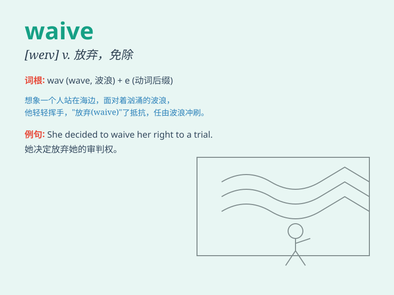

## waive

**英音:** _[weɪv]_ **美音:** _[wev]_

**译义:** *v.放弃*

### 短语

+ **waive a fee:** _免除费用_

+ **waive a right:** _放弃权利_

+ **waive a claim:** _放弃索赔_

+ **waive a penalty:** _免除处罚_

+ **waive a requirement:** _免除要求_

### 例句

#### 例句1

> **The company decided to waive the late fee for this month.**

**中文翻译:** 公司决定免除这个月的滞纳金。

**单词释义:** 免除

#### 例句2

> **He waived his right to a trial by jury.**

**中文翻译:** 他放弃了接受陪审团审判的权利。

**单词释义:** 放弃

#### 例句3

> **The landlord waived the rent for the month due to the tenant\'s
financial hardship.**

**中文翻译:** 由于租户经济困难，房东免除了这个月的租金。

**单词释义:** 免除

### 背诵小故事

> A poor student was unable to pay the tuition. The kind principal
decided to waive the fee. The student was very grateful and promised to
study hard.

**一个贫困学生无法支付学费。善良的校长决定免除这笔费用。这个学生非常感激，并承诺努力学习。**

### 图义

