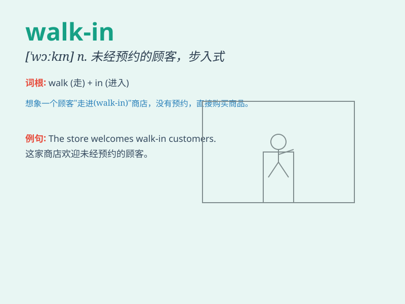

## walk-in

**英音:** _[ˈwɔːk ɪn]_ **美音:** _[ˈwɔːk ɪn]_

**译义:**
*n.未经预约而来的人；可随时进入的商店（或场所）；adj.（服务）不必预约的，可随时进来享受的*

### 短语

+ **walk-in closet:** _步入式衣帽间_

+ **walk-in freezer:** _步入式冷冻库_

+ **walk-in patient:** _未经预约直接来看病的病人_

+ **walk-in shower:** _步入式淋浴间_

+ **walk-in interview:** _无需预约的面试_

### 例句

#### 例句1

> **The doctor\'s office has a walk-in clinic for emergencies.**

**中文翻译:** 医生的办公室有一个为紧急情况设立的无需预约的诊所。

**单词释义:** 无需预约的

#### 例句2

> **We found a walk-in closet in the bedroom.**

**中文翻译:** 我们在卧室里发现了一个步入式衣橱。

**单词释义:** 步入式的

#### 例句3

> **The store offers walk-in services for customers who need
immediate assistance.**

**中文翻译:** 这家商店为需要立即帮助的顾客提供无需预约的服务。

**单词释义:** 无需预约的

### 背诵小故事

> One day, I was in a hurry to buy medicine. I found a pharmacy with a
sign that said \'Walk-in\'. It meant I could enter directly without an
appointment. So I quickly went in and got what I needed.

**有一天，我急着买药。我发现一家药店挂着一个写着'Walk-in'的牌子。这意味着我可以不用预约直接进去。于是我赶紧走进去买到了我需要的东西。**

### 图义

