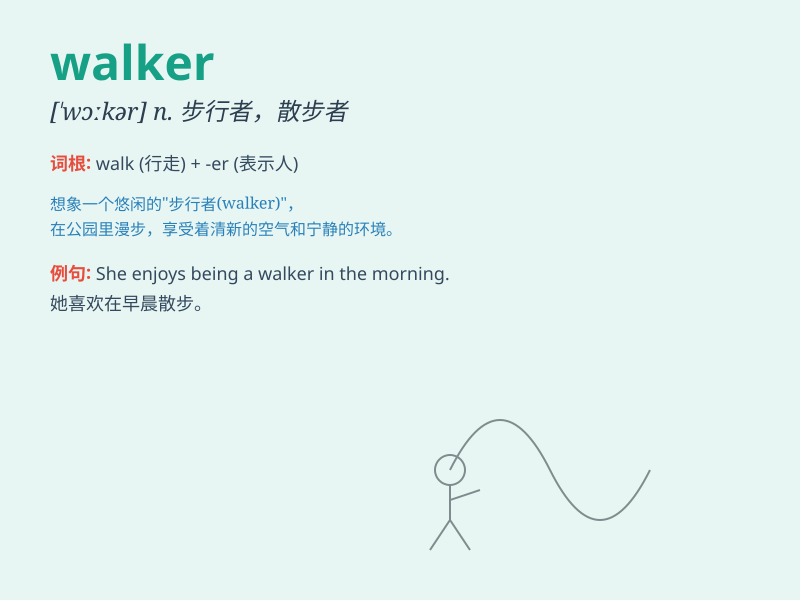

## walker

**英音:** _[\'wɔːkə]_ **美音:** _[\'wɔkɚ]_

**译义:** *n.徒步者,常散步的人,参加竞走者*

### 短语

+ **pedestrian walker:** _步行者_

+ **baby walker:** _婴儿学步车_

+ **pace walker:** _竞走者_

+ **moon walker:** _月球漫步者（常指擅长太空步的人）_

+ **dog walker:** _遛狗的人_

### 例句

#### 例句1

> **The dog walker takes several dogs for a walk every morning.**

**中文翻译:** 这位遛狗者每天早上带好几只狗去散步。

**单词释义:** 遛狗的人

#### 例句2

> **She is an avid walker and enjoys hiking in the mountains.**

**中文翻译:** 她是一个热爱步行的人，喜欢在山里徒步旅行。

**单词释义:** 步行者；散步的人

#### 例句3

> **The baby walker helps the little one move around safely.**

**中文翻译:** 婴儿学步车帮助小宝宝安全地四处移动。

**单词释义:** 学步车

### 背诵小故事

> One day, a little boy was lost in the forest. A mysterious walker
appeared and guided him safely back home. The walker wore a big hat and
carried a stick, looking very experienced.

**有一天，一个小男孩在森林里迷路了。一位神秘的步行者出现，并将他安全地引导回家。这位步行者戴着一顶大帽子，拿着一根手杖，看起来经验丰富。**

### 图义

