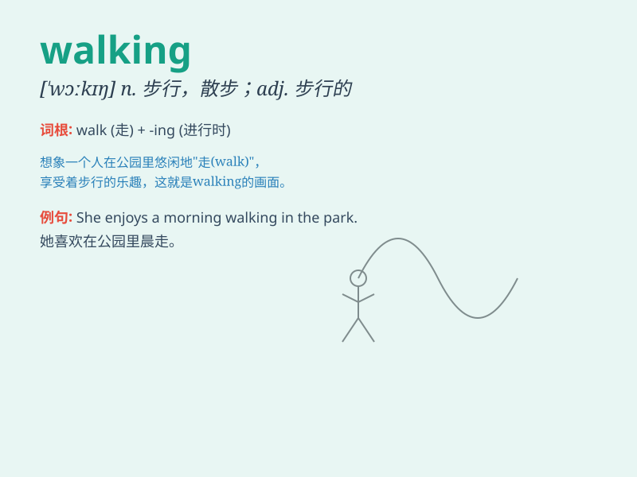

## walking

**英音:** _[ˈwɔːkɪŋ]_ **美音:** _[ˈwɔːkɪŋ]_

**译义:** *v.步行adj.步行的*

### 短语

+ **walking stick:** _手杖；拐杖_

+ **walking distance:** _步行距离_

+ **walking tour:** _徒步旅行；步行观光_

+ **walking shoes:** _步行鞋；散步鞋_

+ **walking race:** _竞走比赛_

### 例句

#### 例句1

> **I enjoy walking in the park on sunny days.**

**中文翻译:** 我喜欢在晴天在公园里散步。

**单词释义:** 散步；行走

#### 例句2

> **She was seen walking along the street alone.**

**中文翻译:** 有人看见她独自沿着街道走。

**单词释义:** 行走；步行

#### 例句3

> **Walking is a good form of exercise.**

**中文翻译:** 散步是一种很好的锻炼方式。

**单词释义:** 散步；步行

### 背诵小故事

> One day, a little boy was lost in a forest. He started walking and
walking, hoping to find his way home. He walked through the tall trees
and across the small streams. Finally, he saw a familiar path and was
saved.

**有一天，一个小男孩在森林里迷路了。他开始不停地走啊走，希望能找到回家的路。他走过高大的树木，穿过小小的溪流。最后，他看到了一条熟悉的小路，得救了。**

### 图义

