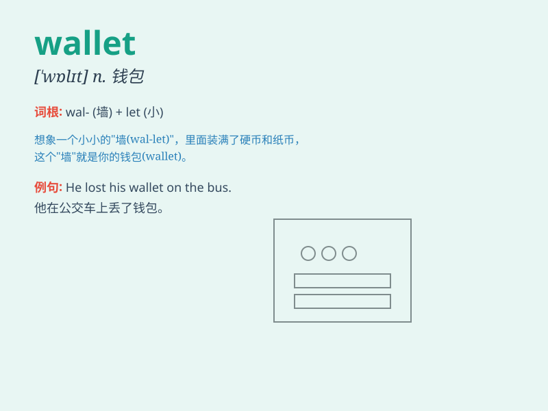

## wallet

**英音:** _[\'wɒlɪt]_ **美音:** _[\'wɑlɪt]_

**译义:** *n.皮夹,钱夹,钓鱼带*

### 短语

+ **leather wallet:** _皮革钱包_

+ **coin wallet:** _硬币钱包_

+ **wallet chain:** _钱包链_

+ **wallet pocket:** _钱包口袋_

+ **electronic wallet:** _电子钱包_

### 例句

#### 例句1

> **He took out his wallet to pay for the meal.**

**中文翻译:** 他掏出钱包来付饭钱。

**单词释义:** 钱包

#### 例句2

> **She lost her wallet on the bus.**

**中文翻译:** 她在公交车上丢了钱包。

**单词释义:** 钱包

#### 例句3

> **The thief stole his wallet when he wasn\'t looking.**

**中文翻译:** 当他没注意时，小偷偷走了他的钱包。

**单词释义:** 钱包

### 背诵小故事

> One day, Tom was in a hurry to catch the bus. But when he reached
into his pocket, he found his wallet was missing. He panicked and
searched everywhere. Finally, he found it on the sofa at home. What a
relief!

**有一天，汤姆匆忙赶公交。但当他把手伸进口袋时，发现他的钱包不见了。他惊慌失措，到处找。最后，他在家里的沙发上找到了。真是松了一口气！**

### 图义

