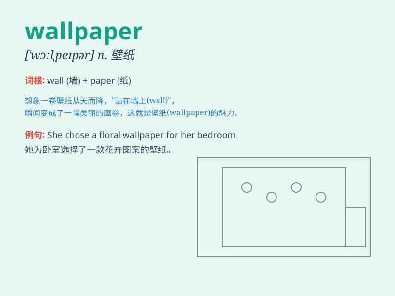

## wallpaper

**英音:** _[\'wɔːlpeɪpə]_ **美音:** _[\'wɔlpepɚ]_

**译义:** *n.壁纸,墙纸v.贴墙纸*

### 短语

+ **wallpaper paste:** _壁纸胶_

+ **desktop wallpaper:** _桌面壁纸_

+ **floral wallpaper:** _花卉壁纸_

+ **wallpaper border:** _壁纸边框_

+ **vintage wallpaper:** _复古壁纸_

### 例句

#### 例句1

> **The wallpaper in the living room is very elegant.**

**中文翻译:** 客厅里的壁纸非常优雅。

**单词释义:** 壁纸；墙纸

#### 例句2

> **She spent the whole afternoon choosing wallpaper for her
bedroom.**

**中文翻译:** 她花了整个下午为她的卧室挑选壁纸。

**单词释义:** 壁纸；墙纸

#### 例句3

> **The old wallpaper was peeling off the walls.**

**中文翻译:** 旧的壁纸从墙上剥落下来。

**单词释义:** 壁纸；墙纸

### 背诵小故事

> One day, I was redecorating my room. I chose a beautiful pattern to
be the wallpaper. It covered the walls and made the room look so nice. I
was very happy with my choice of wallpaper.

**有一天，我在重新装饰我的房间。我选了一个漂亮的图案当作壁纸。它覆盖了墙面，让房间看起来非常好看。我对自己选的壁纸非常满意。**

### 图义

