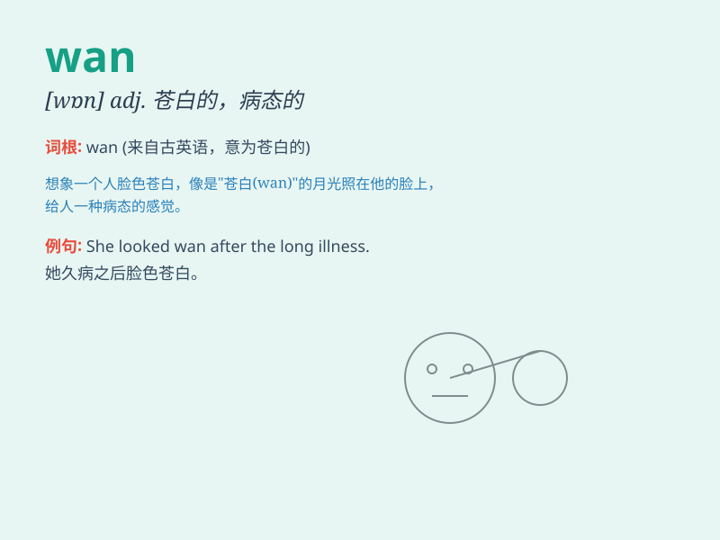

## wan

**英音:** _[wɒn]_ **美音:** _[wɑn]_

**译义:**
*adj.苍白的,无血色的,病态的,暗淡的,无力的;v.(使)变苍白,(使)呈病态;Wide
Area Networks,广域网*

### 短语

+ **wan complexion:** _苍白的脸色_

+ **wan smile:** _惨淡的微笑_

+ **wan light:** _暗淡的光线_

+ **look wan:** _看上去苍白_

+ **become wan:** _变得苍白_

### 例句

#### 例句1

> **She had a wan complexion after being ill for weeks.**

**中文翻译:** 她病了几个星期后，脸色苍白。

**单词释义:** 苍白的；无血色的

#### 例句2

> **His smile was wan and forced.**

**中文翻译:** 他的微笑苍白而勉强。

**单词释义:** 苍白无力的；勉强的

#### 例句3

> **The wan light of dawn filtered through the curtains.**

**中文翻译:** 黎明时微弱的光线透过窗帘。

**单词释义:** 微弱的；暗淡的

### 背诵小故事

> A fairy named Wan had a pale face because she spent too much time in
the dark cave. Her wan complexion made others worried.

**有个叫婉的仙女，由于在黑暗洞穴里待太久，脸色苍白。她苍白的脸色让其他人很担心。**

### 图义

