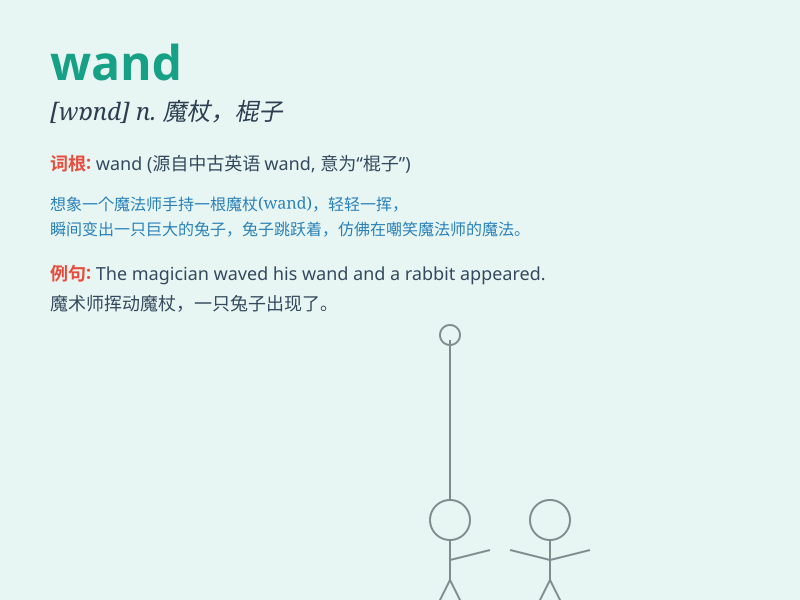

## wand

**英音:** _[wɒnd]_ **美音:** _[wɑnd]_

**译义:** *n.棒,棍,杖,(表示官职的)权杖,(柳树等幼树的)嫩枝*

### 短语

+ **magic wand:** _魔杖_

+ **waving a wand:** _挥动魔杖_

+ **wand of power:** _权力之杖_

+ **crystal wand:** _水晶魔杖_

+ **enchanted wand:** _被施魔法的魔杖_

### 例句

#### 例句1

> **The magician waved the wand and made the rabbit disappear.**

**中文翻译:** 魔术师挥动魔杖，让兔子消失了。

**单词释义:** 魔杖

#### 例句2

> **She held a wand with a shiny star on top.**

**中文翻译:** 她拿着一根顶部有一颗闪亮星星的魔杖。

**单词释义:** 魔杖

#### 例句3

> **The fairy\'s wand sparkled in the moonlight.**

**中文翻译:** 仙女的魔杖在月光下闪闪发光。

**单词释义:** 魔杖

### 背诵小故事

> A young wizard was lost in a dark forest. Suddenly, a magic wand
appeared in front of him. The wand glowed and led him out of the forest.
With the wand, he could perform amazing spells.

**一位年轻的巫师在黑暗的森林中迷路了。突然，一根魔法棒出现在他面前。这根魔杖发光并引领他走出了森林。有了这根魔杖，他能够施展神奇的法术。**

### 图义

