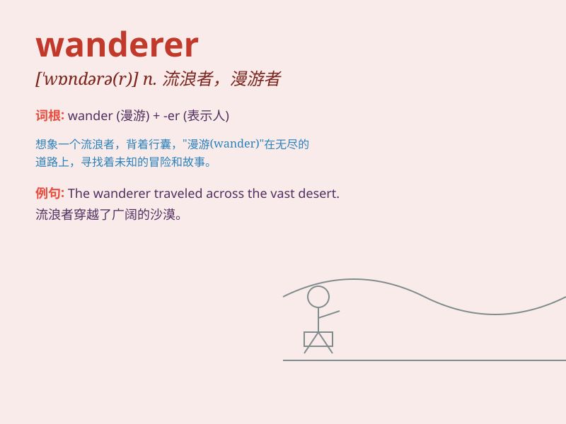

## wanderer

**英音:** _[\'wɒnd(ə)rə(r)]_ **美音:** _[\'wɑndərɚ]_

**译义:** *n.流浪者,徘徊者,迷路的动物*

### 短语

+ **aimless wanderer:** _漫无目的的流浪者_

+ **lonely wanderer:** _孤独的流浪者_

+ **wandering wanderer:** _漂泊的流浪者_

+ **tired wanderer:** _疲惫的流浪者_

+ **lost wanderer:** _迷路的流浪者_

### 例句

#### 例句1

> **The wanderer roamed the countryside in search of a place to call
home.**

**中文翻译:** 这位流浪者在乡间游荡，寻找一个可以称之为家的地方。

**单词释义:** 流浪者

#### 例句2

> **A lonely wanderer walked along the deserted beach.**

**中文翻译:** 一个孤独的流浪者沿着荒芜的海滩走着。

**单词释义:** 流浪者

#### 例句3

> **The old wanderer told stories of his adventures on the road.**

**中文翻译:** 这位年老的流浪者讲述着他在路上的冒险故事。

**单词释义:** 流浪者

### 背诵小故事

> Once upon a time, there was a man who loved to walk aimlessly. He was
a wanderer. He traveled through mountains and valleys, seeing different
sceneries. His heart was full of curiosity and the desire for adventure.

**从前，有一个喜欢漫无目的地行走的人。他是个流浪者。他穿越山川峡谷，见识不同的风景。他的心中充满了好奇和对冒险的渴望。**

### 图义

