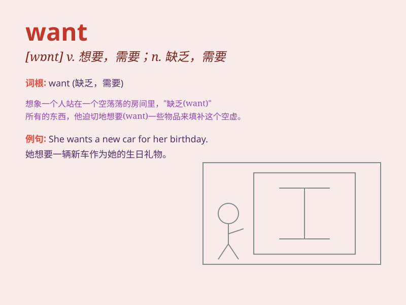

## want

**英音:** _[wɒnt]_ **美音:** _[wɑnt]_

**译义:** *vt.想要,希望,需要,短缺,缺少n.需要,短缺*

### 短语

+ **want for:** _缺少；需要_

+ **want in:** _想要进来_

+ **want out:** _想要出去；想摆脱_

+ **in want of:** _需要；缺少_

+ **want to do sth:** _想要做某事_

### 例句

#### 例句1

> **I want a new bike.**

**中文翻译:** 我想要一辆新自行车。

**单词释义:** 想要

#### 例句2

> **She wants to go shopping this weekend.**

**中文翻译:** 她这周末想去购物。

**单词释义:** 想要

#### 例句3

> **They don\'t want any help.**

**中文翻译:** 他们不想要任何帮助。

**单词释义:** 想要

### 背诵小故事

> One day, Tom saw a cool toy in a store. His eyes sparkled and he felt
a strong desire. He knew he WANTED that toy very much. So, he saved his
pocket money to buy it.

**一天，汤姆在一家商店里看到了一个很酷的玩具。他的眼睛闪闪发光，他感到一种强烈的渴望。他知道自己非常想要那个玩具。于是，他攒起零花钱去买它。**

### 图义

