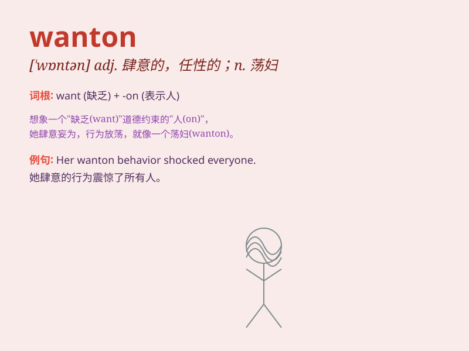

## wanton

**英音:** _[\'wɒntən]_ **美音:** _[\'wɔntən]_

**译义:**
*adj.荒唐的,嬉戏的,繁茂的,肆意的,不道德的,不贞洁的n.荡妇,水性杨花的女人vi.嬉戏,闲荡,放肆vt.挥霍*

### 短语

+ **wanton destruction:** _肆意破坏_

+ **wanton behavior:** _放肆的行为_

+ **wanton cruelty:** _肆意的残忍_

+ **wanton violence:** _肆意的暴力_

+ **wanton waste:** _肆意浪费_

### 例句

#### 例句1

> **The wanton destruction of the forest is a serious environmental
crime.**

**中文翻译:** 对森林的肆意破坏是一种严重的环境犯罪。

**单词释义:** 肆意的；无节制的

#### 例句2

> **She was accused of wanton behavior at the party.**

**中文翻译:** 她被指责在聚会上行为放荡。

**单词释义:** 放荡的；任性的

#### 例句3

> **The wanton waste of resources is unacceptable in today\'s
society.**

**中文翻译:** 在当今社会，资源的肆意浪费是不可接受的。

**单词释义:** 肆意的；毫无顾忌的

### 背诵小故事

> A naughty monkey was wanton in the zoo. It jumped around and messed
up everything. The zookeeper had to scold it. Remember, \'wanton\' means
naughty and unrestrained.

**一只顽皮的猴子在动物园里肆意妄为。它到处乱跳，把一切都弄乱了。动物园管理员不得不训斥它。记住，\'wanton\'意思是顽皮和放肆的。**

### 图义

