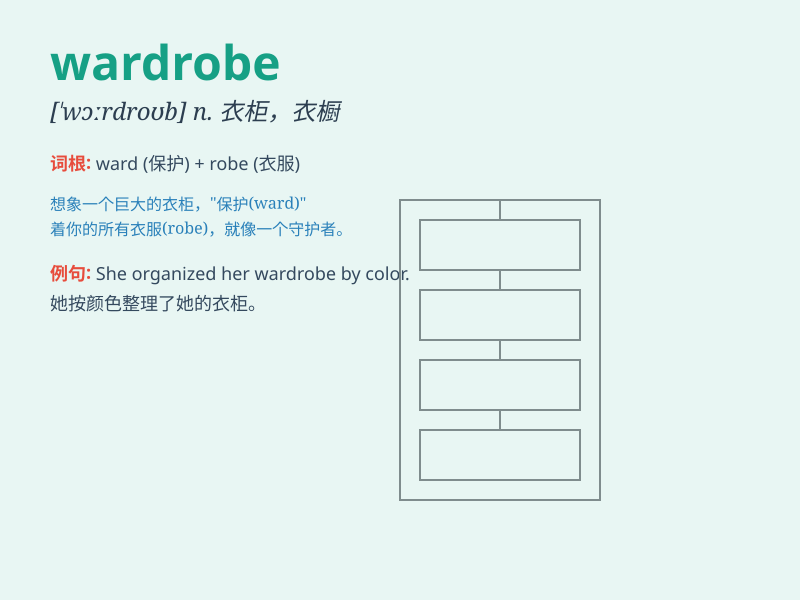

## wardrobe

**英音:** _[\'wɔːdrəʊb]_ **美音:** _[ˈwɔrdˌrob]_

**译义:** *n.衣柜,衣厨,衣室,衣服,行头,剧装*

### 短语

+ **wardrobe malfunction:** _服装故障；走光_

+ **built-in wardrobe:** _嵌入式衣柜_

+ **wardrobe closet:** _衣柜；衣橱_

+ **wardrobe mistress:** _服装管理员（女性）_

+ **wardrobe staple:** _衣柜必备品_

### 例句

#### 例句1

> **She opened the wardrobe to look for her favorite dress.**

**中文翻译:** 她打开衣柜寻找她最喜欢的连衣裙。

**单词释义:** 衣柜

#### 例句2

> **The wardrobe in the guest room is quite small.**

**中文翻译:** 客房里的衣柜相当小。

**单词释义:** 衣柜

#### 例句3

> **He filled the wardrobe with new suits.**

**中文翻译:** 他在衣柜里装满了新西装。

**单词释义:** 衣柜

### 背诵小故事

> One day, Alice was looking for her favorite dress in the wardrobe.
She opened its big doors and found all kinds of clothes neatly placed.
The wardrobe was like a magical closet full of surprises.

**一天，爱丽丝在衣柜里找她最喜欢的裙子。她打开衣柜的大柜门，发现各种各样的衣服整齐摆放着。这个衣柜就像一个充满惊喜的神奇衣橱。**

### 图义

