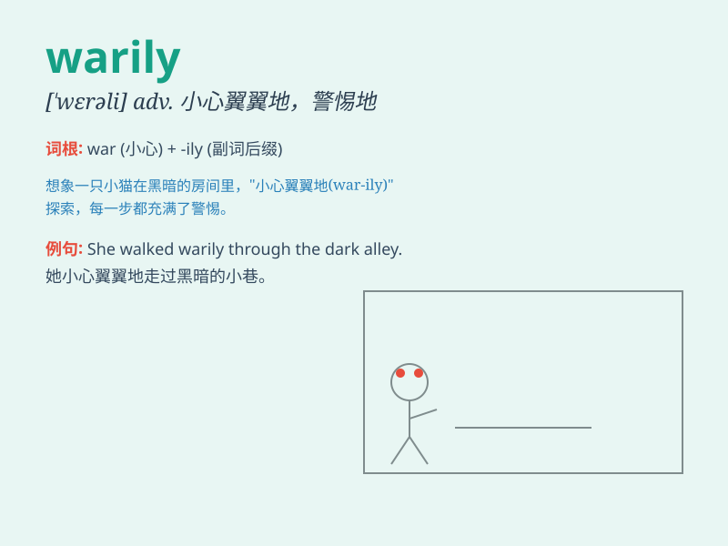

## warily

**英音:** _[\'weərɪlɪ]_ **美音:** _[\'wɛrəli]_

**译义:** *adv.留心地,小心地,警惕地*

### 短语

+ **warily alert:** _警惕地警觉_

+ **warily cautious:** _谨慎地小心_

+ **warily watchful:** _警觉地注视_

+ **warily approach:** _小心翼翼地接近_

+ **warily observe:** _谨慎地观察_

### 例句

#### 例句1

> **She warily eyed the stranger approaching her.**

**中文翻译:** 她警惕地看着向她走来的陌生人。

**单词释义:** 警惕地

#### 例句2

> **He warily stepped onto the icy road.**

**中文翻译:** 他小心翼翼地踏上结冰的道路。

**单词释义:** 小心翼翼地

#### 例句3

> **The cat warily sniffed the food before eating it.**

**中文翻译:** 猫在吃食物之前谨慎地闻了闻。

**单词释义:** 谨慎地

### 背诵小故事

> A thief was warily approaching the house. He moved slowly and
carefully, constantly looking around to make sure no one was watching.
Finally, he entered the house warily.

**一个小偷小心翼翼地靠近房子。他缓慢且谨慎地移动，不停地四处张望以确保没人在看。最后，他小心翼翼地进了房子。**

### 图义

