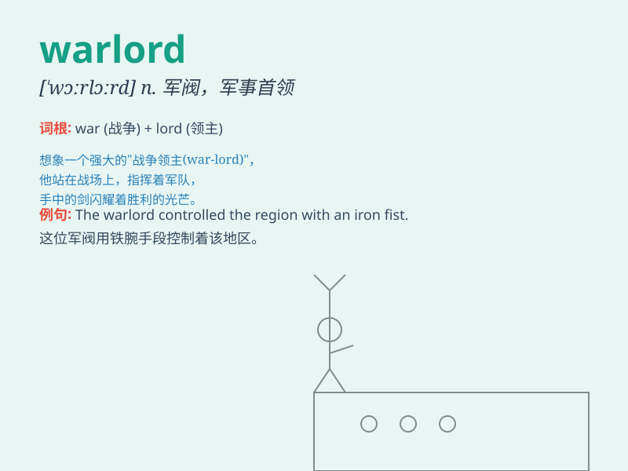

## warlord

**英音:** _[\'wɔːlɔːd]_ **美音:** _[\'wɔrlɔrd]_

**译义:** *n.军阀,军阀式首脑*

### 短语

+ **feudal warlord:** _封建军阀_

+ **local warlord:** _地方军阀_

+ **warlord politics:** _军阀政治_

+ **warlord era:** _军阀时代_

+ **warlord regime:** _军阀政权_

### 例句

#### 例句1

> **The warlord controlled a large territory with his private
army.**

**中文翻译:** 这位军阀凭借他的私人军队控制着一大片领土。

**单词释义:** 军阀

#### 例句2

> **The villagers were at the mercy of the warlord.**

**中文翻译:** 村民们任由这个军阀摆布。

**单词释义:** 军阀

#### 例句3

> **The warlord\'s tyranny caused widespread suffering.**

**中文翻译:** 这个军阀的暴政导致了广泛的苦难。

**单词释义:** 军阀

### 背诵小故事

> In a distant land, there was a powerful man named Jack. He commanded
a huge army and controlled many regions. People called him the warlord.
He was feared but also respected for his military might.

**在一片遥远的土地上，有个叫杰克的强大人物。他指挥着庞大的军队，控制着许多地区。人们称他为军阀。他因军事力量令人畏惧但也受人尊敬。**

### 图义

