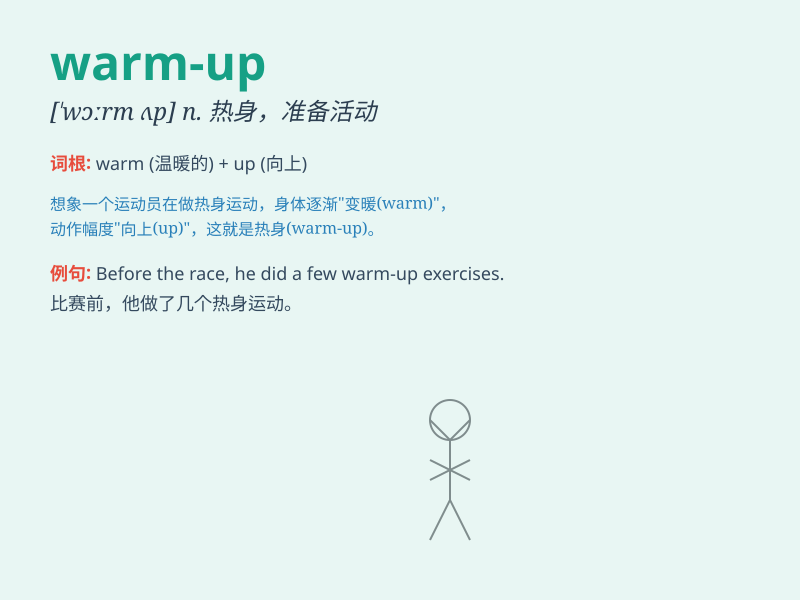

## warm-up

**英音:** _[wɔːm-ʌp]_ **美音:** _[wɔrm-ʌp]_

**译义:** *n.热身,准备活动*

### 短语

+ **warm-up exercise:** _热身运动_

+ **warm-up match:** _热身赛_

+ **warm-up period:** _预热期；热身阶段_

+ **do warm-up:** _做热身_

+ **a series of warm-up:** _一系列的热身活动_

### 例句

#### 例句1

> **The athletes did some warm-up exercises before the race.**

**中文翻译:** 运动员们在比赛前做了一些热身运动。

**单词释义:** 热身；准备活动

#### 例句2

> **The warm-up act got the audience excited for the main show.**

**中文翻译:** 开场前的预热表演让观众对主秀兴奋起来。

**单词释义:** 预热；开场前的准备

#### 例句3

> **We need a warm-up period to adjust to the new working
environment.**

**中文翻译:** 我们需要一个热身期来适应新的工作环境。

**单词释义:** 适应期；准备阶段

### 背诵小故事

> 想象一下，运动员们在比赛前会做 warm-up
活动。他们会慢跑、拉伸，让身体热起来，准备好去迎接激烈的比赛。就像给身体加热，为即将到来的挑战做好充分准备。

**想象运动员在赛前做热身活动，比如慢跑、拉伸，让身体热起来以准备比赛，来理解
warm-up 这个单词，意思是热身；准备活动**

### 图义

