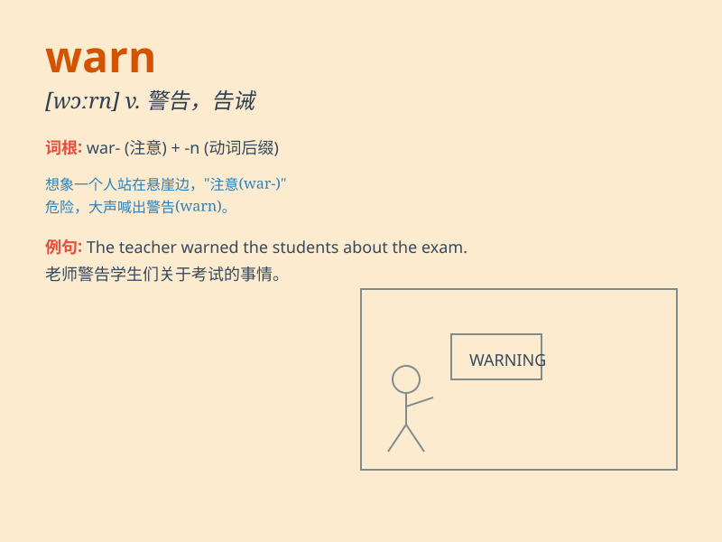

## warn

**英音:** _[wɔːn]_ **美音:** _[wɔrn]_

**译义:** *vt.警告,注意,通知vi.发出警告,发出预告*

### 短语

+ **warn against:** _警告（某人）不要做（某事）_

+ **warn of:** _警告（某人）有（危险、问题等）_

+ **warn off:** _告诫（某人）离开；警告（某人）不得靠近_

+ **warn someone away:** _警告某人离开_

+ **warn someone out of:** _警告某人不要做（某事）_

### 例句

#### 例句1

> **The doctor warned him to stop smoking.**

**中文翻译:** 医生警告他要戒烟。

**单词释义:** 警告

#### 例句2

> **She warned me of the danger ahead.**

**中文翻译:** 她警告我前面有危险。

**单词释义:** 警告

#### 例句3

> **The weather forecast warned of possible floods.**

**中文翻译:** 天气预报警告可能有洪水。

**单词释义:** 警告

### 背诵小故事

> One day, a little boy was about to touch a hot stove. His mother
quickly came and warned him, \'Don\'t touch it, or you\'ll get hurt!\'
The boy understood and stayed away. So, \'warn\' means to tell someone
about possible danger.

**一天，一个小男孩正要去摸一个热炉子。他妈妈迅速过来警告他：'别碰它，否则你会受伤的！'男孩明白了并远离了。所以，'warn'意思是告诉某人可能的危险。**

### 图义

