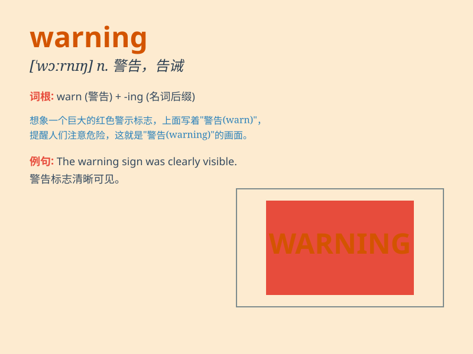

## warning

**英音:** _[\'wɔːnɪŋ]_ **美音:** _[\'wɔrnɪŋ]_

**译义:** *n.警告,预告,通知,预兆*

### 短语

+ **early warning:** _早期预警_

+ **warning sign:** _警告标志_

+ **weather warning:** _气象警报_

+ **warning system:** _警报系统_

+ **give warning:** _发出警告_

### 例句

#### 例句1

> **The weather forecast issued a warning of heavy rain.**

**中文翻译:** 天气预报发布了大雨警告。

**单词释义:** 警告；警示

#### 例句2

> **He ignored the warning signs and got into trouble.**

**中文翻译:** 他忽视了警告标志，陷入了麻烦。

**单词释义:** 警告；警示

#### 例句3

> **The doctor gave her a warning about her diet.**

**中文翻译:** 医生就她的饮食给了她一个警告。

**单词释义:** 警告；告诫

### 背诵小故事

> One day, Tom was playing in the forest. Suddenly, a bird chirped
loudly as a warning. It seemed to tell Tom that a storm was coming. Tom
understood and quickly ran home.

**一天，汤姆在森林里玩耍。突然，一只鸟大声鸣叫作为警告。它似乎在告诉汤姆暴风雨要来了。汤姆明白了，迅速跑回家。**

### 图义

