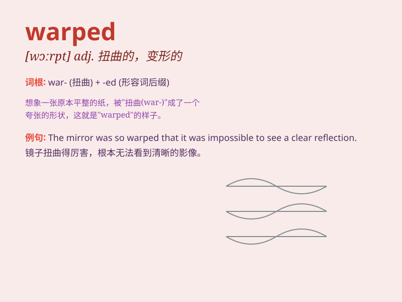

## warped

**英音:** _[wɔːpt]_ **美音:** _[wɔːrpt]_

**译义:** *adj. 扭曲的；变形的；歪曲的；有偏见的 vt.
使变形；使翘曲（warp的过去式和过去分词）*

### 短语

+ **warped mind:** _扭曲的思想_

+ **warped board:** _翘曲的木板_

+ **warped perception:** _歪曲的看法_

+ **warped reality:** _扭曲的现实_

+ **warped sense of humor:** _怪异的幽默感_

### 例句

#### 例句1

> **The warped board was no longer suitable for the table.**

**中文翻译:** 这块弯曲的木板不再适合做桌子了。

**单词释义:** 弯曲的；变形的

#### 例句2

> **His warped sense of humor often leaves others confused.**

**中文翻译:** 他那扭曲的幽默感常常让别人感到困惑。

**单词释义:** 扭曲的

#### 例句3

> **The warped window frame let in the cold air.**

**中文翻译:** 变形的窗框让冷空气进来了。

**单词释义:** 变形的；扭曲的

### 背诵小故事

> A carpenter was working with wood. But he left the wood in water for
too long. When he took it out, it was warped. The shape was no longer
straight. Poor carpenter!

**一位木匠正在加工木材。但他把木材在水里泡得太久了。当他拿出来时，木材弯曲变形了。形状不再笔直。可怜的木匠！**

### 图义

