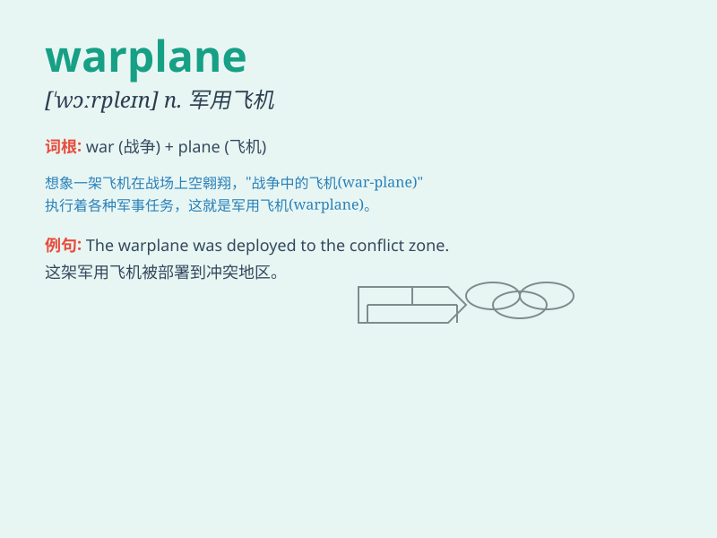

## warplane

**英音:** _[\'wɔːpleɪn]_ **美音:** _[\'wɔrplen]_

**译义:** *n.[军]军用机*

### 短语

+ **military warplane:** _军用战机_

+ **advanced warplane:** _先进的战机_

+ **enemy warplane:** _敌方战机_

+ **stealth warplane:** _隐形战机_

+ **combat warplane:** _作战飞机_

### 例句

#### 例句1

> **The warplane soared through the sky on a reconnaissance
mission.**

**中文翻译:** 这架战机在天空中翱翔，执行侦察任务。

**单词释义:** 战机

#### 例句2

> **Enemy warplanes were detected approaching our territory.**

**中文翻译:** 发现敌方战机正在接近我们的领土。

**单词释义:** 战机

#### 例句3

> **The advanced warplane is equipped with the latest technology.**

**中文翻译:** 这架先进的战机配备了最新的技术。

**单词释义:** 战机

### 背诵小故事

> In a fierce battle, our soldiers were in danger. Suddenly, a warplane
appeared in the sky. It was like a savior, ready to strike the enemy and
protect us. The warplane was our hope and strength.

**在一场激烈的战斗中，我们的士兵处于危险之中。突然，天空中出现了一架战机。它就像救星一样，准备打击敌人并保护我们。这架战机是我们的希望和力量。**

### 图义

