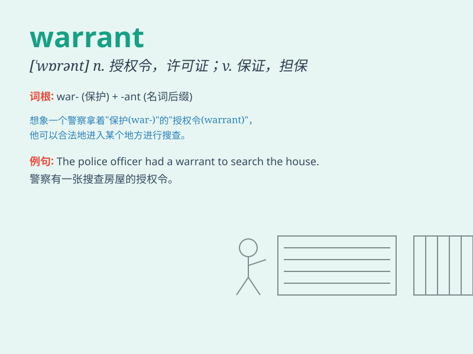

## warrant

**英音:** _[\'wɒr(ə)nt]_ **美音:** _[\'wɔrənt]_

**译义:**
*n.授权,正当理由,根据,证明,凭证,委任状,批准,许可证vt.保证,辩解,担保,批准,使有正当理由*

### 短语

+ **arrest warrant:** _逮捕证；逮捕令_

+ **search warrant:** _搜查证；搜查令_

+ **warrant officer:** _准尉_

+ **warrant of fitness:** _（车辆的）安全性能检验证_

+ **warrant for payment:** _付款授权书_

### 例句

#### 例句1

> **The police obtained a warrant to search the house.**

**中文翻译:** 警察获得了搜查这所房子的搜查令。

**单词释义:** 搜查令；授权令

#### 例句2

> **His actions warrant serious punishment.**

**中文翻译:** 他的行为应当受到严厉惩罚。

**单词释义:** 使有必要；值得

#### 例句3

> **There is no warrant for such a claim.**

**中文翻译:** 这种说法没有根据。

**单词释义:** 根据；正当理由

### 背诵小故事

> A thief was caught stealing, but the police needed a warrant to
search his house. Finally, they got the warrant and found the stolen
goods. The warrant gave them the legal right to do the search.

**一个小偷被抓到偷东西，但警察需要一张搜查令才能搜查他的房子。最后，他们拿到了搜查令并找到了赃物。搜查令给了他们进行搜查的合法权利。**

### 图义

