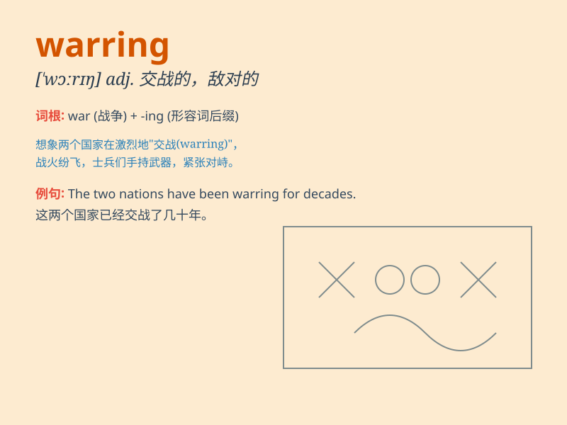

## warring

**英音:** _[\'wɔːrɪŋ]_ **美音:** _[\'wɔrɪŋ]_

**译义:** *adj.敌对的,交战的n.发动战争,战斗*

### 短语

+ **warring states:** _战国_

+ **warring factions:** _交战的派别_

+ **warring parties:** _交战各方_

+ **warring camps:** _对立的阵营_

+ **warring tribes:** _交战的部落_

### 例句

#### 例句1

> **The warring factions finally agreed to a ceasefire.**

**中文翻译:** 交战的派系最终同意停火。

**单词释义:** 交战的

#### 例句2

> **The warring states were constantly at war with each other.**

**中文翻译:** 那些交战的国家彼此之间不断打仗。

**单词释义:** 交战的

#### 例句3

> **The warring parties reached a peace settlement after years of
conflict.**

**中文翻译:** 经过多年的冲突，交战各方达成了和平解决方案。

**单词释义:** 交战的

### 背诵小故事

> In a faraway land, there were two kingdoms constantly at war. The
people were always in fear. This state of continuous fighting was
described as \'warring\'.

**在一个遥远的地方，有两个王国一直在打仗。人民总是处于恐惧之中。这种持续战斗的状态被描述为\'warring（交战的；敌对的）\'。**

### 图义

