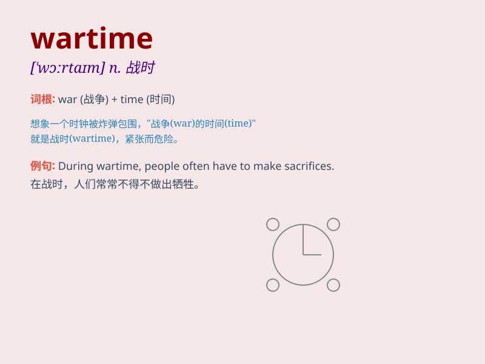

## wartime

**英音:** _[\'wɔːtaɪm]_ **美音:** _[\'wɔrtaɪm]_

**译义:** *n.战时*

### 短语

+ **wartime economy:** _战时经济_

+ **wartime conditions:** _战时状况_

+ **wartime strategy:** _战时策略_

+ **wartime memories:** _战时回忆_

+ **wartime rationing:** _战时配给_

### 例句

#### 例句1

> **During wartime, food shortages were common.**

**中文翻译:** 在战争时期，食物短缺很常见。

**单词释义:** 战争时期

#### 例句2

> **The country\'s economy suffered greatly in wartime.**

**中文翻译:** 这个国家的经济在战争时期遭受了巨大的损失。

**单词释义:** 战争时期

#### 例句3

> **Wartime experiences left a deep scar on his mind.**

**中文翻译:** 战争时期的经历在他的心灵上留下了深深的创伤。

**单词释义:** 战争时期

### 背诵小故事

> In the wartime, a brave soldier named Tom was always ready to defend
his country. He fought bravely and never gave up. His spirit inspired
everyone. Remember, \'wartime\' means a period when a war is being
fought.

**在战时，一位名叫汤姆的勇敢士兵总是准备好保卫他的国家。他英勇作战，从不放弃。他的精神鼓舞了每个人。记住，'wartime'意思是战争正在进行的时期。**

### 图义

