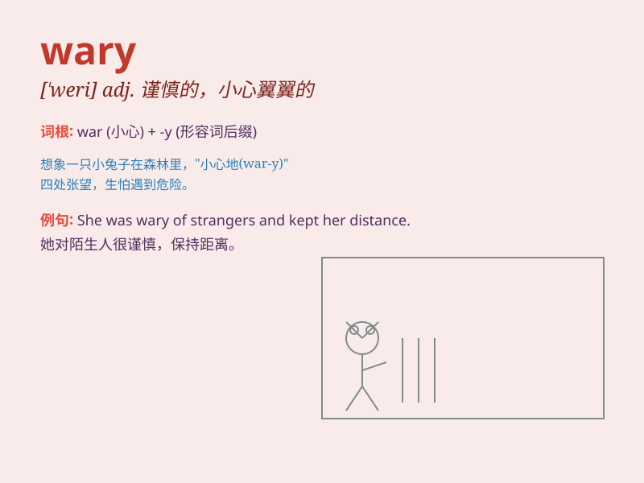

## wary

**英音:** _[\'weərɪ]_ **美音:** _[\'wɛri]_

**译义:** *adj.机警的*

### 短语

+ **be wary of:** _对\...\...小心；谨防\...\..._

+ **wary look:** _警惕的神情_

+ **remain wary:** _保持警惕_

+ **wary attitude:** _谨慎的态度_

+ **wary traveler:** _谨慎的旅行者_

### 例句

#### 例句1

> **She was wary of strangers and avoided eye contact.**

**中文翻译:** 她对陌生人很警惕，避免眼神接触。

**单词释义:** 警惕的；谨慎的

#### 例句2

> **The company is wary of making large investments at the
moment.**

**中文翻译:** 这家公司目前对进行大规模投资持谨慎态度。

**单词释义:** 谨慎的；小心的

#### 例句3

> **He was wary of getting too close to the edge of the cliff.**

**中文翻译:** 他小心翼翼，不敢离悬崖边太近。

**单词释义:** 小心的；谨慎的

### 背诵小故事

> One day, a little rabbit was in the forest. It saw a strange shadow
and became wary. It stopped moving and carefully observed. It was ready
to run away if it was in danger. Finally, it found it was just a fallen
tree branch and felt relieved.

**一天，一只小兔子在森林里。它看到一个奇怪的影子，变得小心谨慎起来。它停止移动，仔细观察。如果有危险，它准备逃跑。最后，它发现只是一根倒下的树枝，松了口气。**

### 图义

